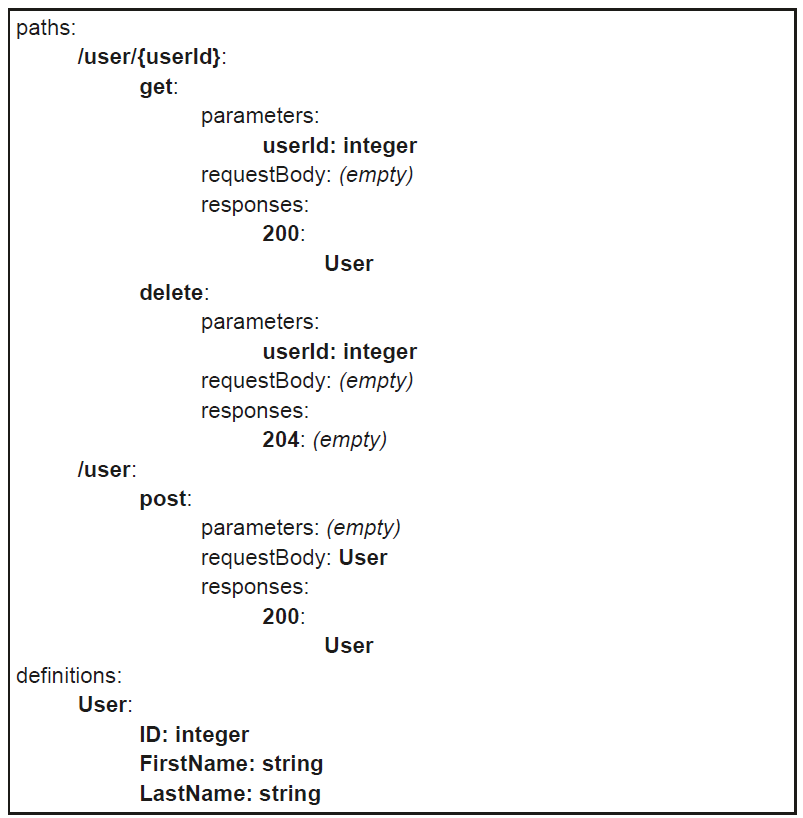

## Arch at a Glance

1. **The API server** – this is the **central point** on the control-plane; the user and the various pieces of the control-plane contact this API to create, get, delete, update, and watch resources.
   
2. **The etcd database** – this is **only accessible by** the API Server, is used to **persist** the data relative to resources.
   
3. **The Controller manager** – this runs the controllers that transform **high-level** resources declared by the user **into low-level** resources to be deployed on nodes. The controllers are connected to the API Server, **watching** for high-level resources and creating, deleting, and updating low-level resources to satisfy the spec declared in high-level resources.
   
4. **Scheduler** – this distributes the low-level resources on the various nodes. The Scheduler is connected to the API Server to **watch** for unaffected resources and **connect** them **to nodes**.
    
5. **Kubelet** – this is an agent running on all nodes of the cluster, and each **agent manages the workloads** affected to its node. The kubelet is connected to the API Server to **watch** for Pods resources affected to its node and to deploy the associated containers **using the local container runtime**.
    
6. **Kube proxy** – this is an agent running on all nodes of the cluster, and each **agent manages the network configurations** affected to its node. The kube proxy is connected to the API Server to **watch** for Service resources and to configure associated network rules on its node.

  

## OpenAPI Spec

K8s API is HTTP REST API in OpenAPI format. K8s supports [v3](https://github.com/kubernetes/kubernetes/tree/master/api/openapi-spec) spec.

An OpenAPI specification is made up of a list of **paths** and a list of definitions.

The **paths** are the URLs you use to request this API, and for each path, the specification gives the distinct operations by verbs.

**Example:**

User API accepts 2 paths:

- `/user/{userId}` accepts 2 operations `get` & `delete`
- `/user` accepts  1 operation `post`

A definition of a structure User is given, describing the information for a
user. It is used in the **response body** of the `get` on `/user/{userId}`, and in the **request body** of the `post` on `/user`.

## Verbs & Kind

The Kubernetes Kinds are a **subset** of the definitions in the OpenAPI spec.

When requests are made to the K8s API, data structures are exchanged through the bodies of requests and responses. These structures share **common fields**, `apiVersion` and `kind`.

**K8s [extensions](https://github.com/kubernetes/kubernetes/tree/master/api/openapi-spec#vendor-extensions) on OpenAPI**:

- `x-kubernetes-group-version-kind`

- `x-kubernetes-action`

- `x-kubernetes-patch-strategy`

- `x-kubernetes-patch-merge-key`

## GVR

**Group-Version-Resource**: each resource is **uniquely identified & grouped**.

Resources can have **sub-resources**, `*/<res-name>/<sub-resource>`

| Path                                               | Desc                                                    |
| -------------------------------------------------- | ------------------------------------------------------- |
| `/api/v1/<plural>`                                 | To access legacy non-ns-ed resources                    |
| `/api/v1/namespaces/<ns>/<plural>`                 | To access legacy ns-ed resources in a specific ns       |
| `/apis/<group>/<version>/<plural>`                 | To access non-ns-ed resources in specific group and ver |
| `/apis/<group>/<version>/namespaces/<ns>/<plural>` | To access ns-ed resources in a specific ns              |

## Official [API](https://kubernetes.io/docs/reference/kubernetes-api/) Ref. Doc.

- [Deployment](https://kubernetes.io/docs/reference/kubernetes-api/workload-resources/deployment-v1/)
  - `apiVersion: apps/v1`         → YAML
  - `import "k8s.io/api/apps/v1"` → package
  - DeployementSpec: specification of the desired behavior.
  - DeployementStatus: most recently observed.
  - DeployementList: a list of
  - Operations (on resource & sub-res)

