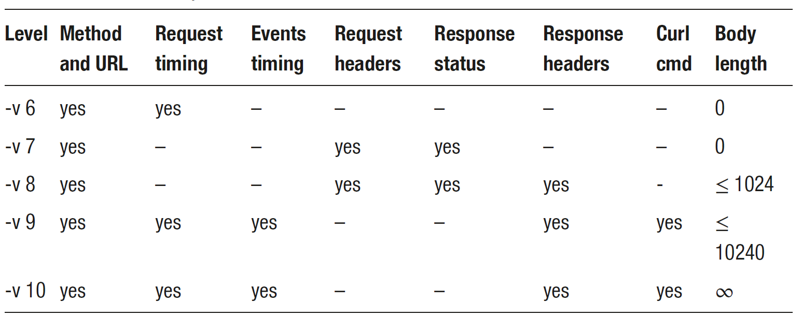
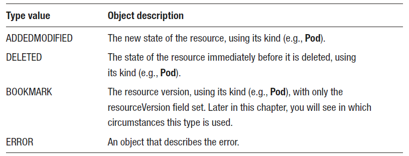

## Examining Requests

kubectl verbosity level. DEBUG since v6.

```bash
$ kubectl ... -v[x]
```



## Making Requests

```yaml
$ cat > pod.yaml <<EOF
apiVersion: v1
kind: Pod
metadata:
  name: nginx
spec:
  containers:
  - image: nginx
    name: nginx
EOF
```

```bash
$ kubectl proxy
$ HOST=http://127.0.0.1:8001
$ curl $HOST/api/v1/namespaces/default/pods \
-H "Content-Type: application/yaml" \
--data-binary @pod.yaml

# or simply
$ kubectl create --namespace default -f pod.yaml -o json
```

### Getting Information About a Resource

```bash
$ curl -X GET $HOST/api/v1/namespaces/default/pods/nginx
# equivalent to
$ kubectl get pods --namespace project1 nginx -o json
```

### Getting the List of Resources

Cluster-wide

```bash
$ curl $HOST/api/v1/pods
# or
$ kubectl get pods --all-namespaces -o json
```

In specific ns

```bash
$ curl $HOST/api/v1/namespaces/default/pods
# or
$ kubectl get pods --namespace default -o json
```

### Filtering the Result of a List

Label K/V

```bash
$ kubectl run nginx1 --image nginx --labels mylabel=foo
$ kubectl run nginx2 --image nginx --labels mylabel=bar

$ kubectl get pods nginx1 -o yaml
$ kubectl get pods nginx2 -o yaml

$ curl "$HOST/api/v1/namespaces/default/pods?labelSelector=mylabel"
$ curl "$HOST/api/v1/namespaces/default/pods?labelSelector\!=mylabel"
$ curl "$HOST/api/v1/namespaces/default/pods?labelSelector=mylabel=foo"
$ curl "$HOST/api/v1/namespaces/default/pods?labelSelector=mylabel\!=foo"

# in
$ curl "$HOST/api/v1/namespaces/default/pods?labelSelector=mylabel+in+(foo,baz)"
$ curl "$HOST/api/v1/namespaces/default/pods?labelSelector=mylabel+notin+(foo,baz)"

# and
$ curl "$HOST/api/v1/namespaces/default/pods?labelSelector=mylabel,otherlabel=bar"
```

### [Field Selector](https://kubernetes.io/docs/concepts/overview/working-with-objects/field-selectors/)

```bash
$ curl "$HOST/api/v1/namespaces/default/pods?fieldSelector=status.phase=Running"
$ curl "$HOST/api/v1/namespaces/default/pods?fieldSelector=status.phase\!=Running"
$ curl "$HOST/api/v1/namespaces/default/pods?fieldSelector=status.phase\!=Running,spec.restartPolicy\!=Always"
```

### Delete a Resource

```bash
$ curl -X DELETE $HOST/api/v1/namespaces/default/pods/nginx
# or
$ kubectl delete pods --namespace default nginx
```

### Delete a Collection of Resources

```bash
$ curl -X DELETE $HOST/api/v1/namespaces/default/pods
# or
$ kubectl delete pods --namespace default --all
```

### Updating a Resource

```yaml
$ cat > deploy.yaml << EOF
apiVersion: apps/v1
kind: Deployment
metadata:
  name: nginx
spec:
  selector:
    matchLabels:
      app: nginx
  template:
    metadata:
      labels:
        app: nginx
    spec:
      containers:
        - image: nginx
          name: nginx
EOF
```

```bash
# create
$ curl $HOST/apis/apps/v1/namespaces/project1/deployments \
-H "Content-Type: application/yaml" \
--data-binary @deploy.yaml

# replace image: nginx with image: nginx:latest
$ cat deploy.yaml | sed 's/image: nginx/image: nginx:latest/' > deploy2.yaml

# update
curl -X PUT $HOST/apis/apps/v1/namespaces/project1/deployments \
-H "Content-Type: application/yaml" \
--data-binary @deploy2.yaml

# or
$ kubectl replace --namespace default -f deploy2.yaml -o json
```

### Managing Conflicts When Updating a Resource When updating

To avoid this risk of conflict, get **resourceVersion** first & indicate in spec of resource u want to update.

the API server will compare the **resourceVersion** of the received resource and the current one.

If the values differ (concurrent modify), he API server will reply with an **error = conflict happened**.

```bash
# create
$ curl $HOST/apis/apps/v1/namespaces/project1/deployments \
-H "Content-Type: application/yaml" \
--data-binary @deploy.yaml | grep resourceVersion

# get
$ curl $HOST/apis/apps/v1/namespaces/default/deployments/nginx | grep resourceVersion
```

```yaml
# add to spec
$ cat > deploy.yaml << EOF
apiVersion: apps/v1
kind: Deployment
metadata:
  name: nginx
  resourceVersion: "..." # resourceVersion from get
spec:
  selector:
    matchLabels:
      app: nginx
  template:
    metadata:
      labels:
        app: nginx
    spec:
      containers:
        - image: nginx
          name: nginx
EOF
```

```bash
# update
curl -X PUT $HOST/apis/apps/v1/namespaces/project1/deployments \
-H "Content-Type: application/yaml" \
--data-binary @deploy2.yaml
```

### Using a Strategic Merge Patch to Update a Resource

Instead of sending the complete description of it, we could send only parts that u want to modify by **Patch**.

content-type: `application/strategic-merge-patch+json`

```bash
$ cat > deploy-patch.json <<EOF
{
    "spec": {
        "template": {
            "spec": {
                "containers": [
                    {
                        "name": "nginx",
                        "image": "nginx:alpine"
                    }
                ]
            }
        }
    }
}
EOF

$ curl -X PATCH $HOST/apis/apps/v1/namespaces/project1/deployments/nginx \
-H "Content-Type: application/strategic-merge-patch+json" \
--data-binary @deploy-patch.json

# or
$ kubectl patch deployment nginx --namespace default \
--patch-file deploy-patch.json \
--type=strategic \
-o json
```

### Patching Array Fields

Patch Strategy

- `Replace`: the resulting array is the one contained in the patch, and the values present in the original array are not considered.
- `Merge`: the original array and the patch array will be merged.

```bash
$ kubectl patch <resource_type> <resource_name> --patch '{"spec":{"key":"value"}}' --type merge
$ kubectl patch <resource_type> <resource_name> --patch '{"spec":{"key":"value"}}' --type replace
```

It is possible to override these default behaviors by using special **Directives** providing granular control over patch.

- **replace**

```json
# replace "runAsNonRoot" to false while keeps other fields
{
    "spec": {
        "template": {
            "spec": {
                "containers": [
                    {
                        "name": "nginx",
                        "securityContext": {
                            "$patch": "replace",
                            "runAsNonRoot": false
                        }
                    }
                ]
            }
        }
    }
}
# replace only key1 with value in env
{
    "spec": {
        "template": {
            "spec": {
                "containers": [
                    {
                        "name": "nginx",
                        "env": [
                            {
                                "$patch": "replace"
                            },
                            {
                                "name": "key1",
                                "value": "value1"
                            }
                        ]
                    }
                ]
            }
        }
    }
```

- **delete**

```json
# delete only key1 with value in env
{
    "spec": {
        "template": {
            "spec": {
                "containers": [
                    {
                        "name": "nginx",
                        "env": [
                            {
                                "name": "key1",
                                "$patch": "delete"
                            }
                        ]
                    }
                ]
            }
        }
    }
}
```

- **deleteFromPrimitiveList**

```json
# delete --debug from args
{
    "spec": {
        "template": {
            "spec": {
                "containers": [
                    {
                        "name": "nginx",
                        "$deleteFromPrimitiveList/args": [
                            "--debug"
                        ]
                    }
                ]
            }
        }
    }
}
```

- **setElementOrder**

```json
# re-order initContainers
{
    "spec": {
        "template": {
            "spec": {
                "$setElementOrder/initContainers": [
                    {
                        "name": "init2"
                    },
                    {
                        "name": "init1"
                    }
                ]
            }
        }
    }
}
```

### Applying Resources Server-side

**Server-side Apply** since v1.22: Update-like even resource does not exist in the cluster

content-type: `application/apply-patch+yaml`

Save "to-patch" in a dedicated field `.metadata.managedFields`. ← **Field Manager** owned & to apply.

Conflict occurs if updates on fields owned by another **Field Manager** (Force-able)

```yaml
$ cat > deploy.yaml << EOF
apiVersion: apps/v1
kind: Deployment
metadata:
  name: nginx
spec:
  selector:
    matchLabels:
      app: nginx
  template:
    metadata:
      labels:
        app: nginx
    spec:
      containers:
      - image: nginx
        name: nginx
        env:
        - name: key1
          value: value1
        - name: key2
          value: value2
        - name: key3
          value: value3
EOF
```

```bash
# patch & specify fieldManager
$ curl -X PATCH \
$HOST/apis/apps/v1/namespaces/project1/deployments/nginx?fieldManager=manager1 \
-H "Content-Type: application/apply-patch+yaml" \
--data-binary @deploy.yaml

# chk
$ kubectl get deploy nginx -o jsonpath={.metadata.managedFields} | jq
```

```yaml
$ cat > patch1.yaml << EOF
apiVersion: apps/v1
kind: Deployment
metadata:
  name: nginx
spec:
  template:
    spec:
      containers:
      - name: nginx
        env:
        - name: key2
          value: value2bis
EOF
```

```bash
# force patch & specify another fieldManager
curl -X PATCH \
"$HOST/apis/apps/v1/namespaces/project1/deployments/nginx?fieldManager=manager2&force=true" \
-H "Content-Type: application/apply-patch+yaml" \
--data-binary @patch1.yaml
```

```yaml
$ cat > patch2.yaml << EOF
apiVersion: apps/v1
kind: Deployment
metadata:
  name: nginx
spec:
  selector:
    matchLabels:
      app: nginx
  template:
    metadata:
      labels:
        app: nginx
    spec:
      containers:
      - image: nginx
        name: nginx
        env:
        - name: key1
          value: value1
EOF
```

```bash
# manager1 keeps key1/valu1 env only
$ curl -X PATCH \
"$HOST/apis/apps/v1/namespaces/project1/deployments/nginx?fieldManager=manager1"
-H "Content-Type: application/apply-patch+yaml" \
--data-binary @patch2.yaml
```

```bash
$ kubectl get deployments.apps nginx -o yaml
```

```yaml
spec:
  containers:
  - name: nginx
    image: nginx
    env:
    - name: key1         # owned by manager1
      value: value1
    - name: key2         # owned by manager2
      value: value2bis

```

### Watching Resources

JSON obj stream upon a keep-alived conn, AKA a **Watch Event** (type + obj).



```bash
$ curl "$HOST/api/v1/namespaces/default/pods?watch=true"
# or
$ kubectl get pods --namespace default --watch -o json

# ++ label selector
$ curl "$HOST/api/v1/namespaces/default/pods?labelSelector=mylabel?watch=true"
```

### Watching After Listing Resources

Starting from a resourceVersion.

```bash
$ curl "$HOST/api/v1/namespaces/default/pods?watch=true&resourceVersion=..."
```

### Restarting a watch Request

Restarting from the last modification.

During the watch, each JSON obj contains the type of operation & **trace-able resouceVersion**.

```bash
$ curl "$HOST/api/v1/namespaces/default/pods?watch=true"
```

When restarting a watch request, you will be able to use the resourceVersion of a pod that matches the selectors; however, lots of events on other pods could have happened after this one. The API server will have to execute the filtering of all pods’ events that have been created in the meantime at the point where you restart the watch on this old resourceVersion. → **Costy & Pressure** :cry:

++ Bookmark to ask the API server to send **BOOKMARK events** regularly that contain the latest resourceVersion.

```bash
$ kubectl run nginx1 --image nginx --labels mylabel=foo
$ kubectl run nginx2 --image nginx --labels mylabel=bar
```

```bash
# watch with label selector
curl "$HOST/api/v1/namespaces/default/pods?labelSelector=mylabel=foo&watch=true&allowWatchBookmarks=true"
```

```bash
# delete 
$ kubectl delete pods nginx2

# no watch event since label not matched.

# restart watch with last resourceVersion, will not lost events btw
curl "$HOST/api/v1/namespaces/default/podslabelSelector=mylabel=foo&watch=true&allowWatchBookmarks=true&resourceVersion=..."
```

### Paginating Results

`limit` to indicate max num of elements to return & `continue` (token) as pointer to next chunk.

```bash
$ curl "$HOST/api/v1/pods?limit=1"
$ curl "$HOST/api/v1/pods?limit=1&continue=<continue_token_1>"
```

### Consistency of the Full List

List response will be **cached** on the server to guarantee consistency, means any **touch will not affect the next chunk**.

Note: cache will expire & get 410 (Gone).

### Detecting the Last Chunk

**remainingItemCount** indicates the number of elements remaining to complete the full response.

But it's only avail for requests without selectors.

If List with paging, server is unable to know the num of element in full list, sends `continue` instead.

## Getting Results in Various Formats

`Accept` header.

- **columnDefinitions**
  - name
  - type
  - format
  - description
  - priority
- **rows**
  - cells
  - conditions
  - object

```bash
$ curl $HOST/api/v1/pods \
-H 'Accept: application/json;as=Table;g=meta.k8s.io;v=v1'
```

YAML

```bash
$ curl $HOST/api/v1/pods -H 'Accept: application/yaml'
```

