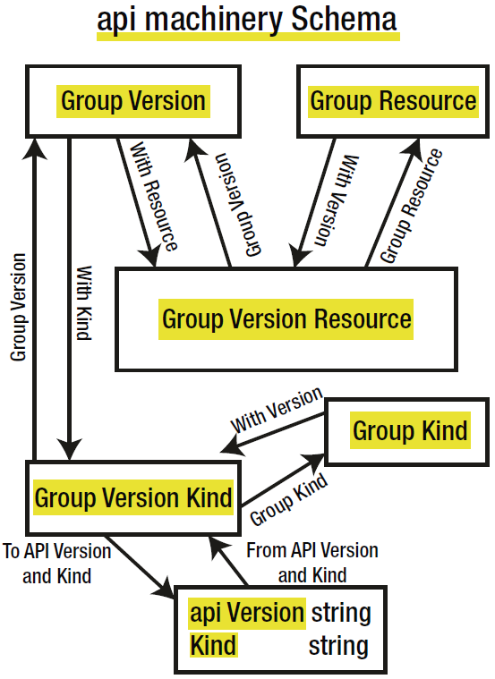

API Machinery offers **utilities** working with K8s API following K8s conventions:

- API embeded common metadata structure: `TypeMeta` containing `APIVersion` & `Kind`.
- API are provided in a **separate package**.
- API are **versioned**.

API Machinery utilities:

- **Scheme** 处理 API (对象) 的机制
  - **reg** API as GVK
  - **convert** API btw ver
  - **serialize/de-serialize** API
- **RESTMapper**: Map API → REST resource

## Schema Package

It defines useful structures and func to work with Group/Versions/Kinds/Resources.

- `GroupVersionResource`
- `GroupVersionKind`
- `GroupVersion`
- `GroupResource`
- `GroupKind`

Convert func:

- `ToAPIVersionAndKind`
- `FromAPIVersionAndKind`

```go
import (
	"k8s.io/apimachinery/pkg/runtime/schema"
)
```





## Scheme

It is **advisable** to initialize the Scheme structure and to add known types to it at `init` func.

```go
import (
	"k8s.io/apimachinerys/pkg/runtime"
)
```

```go
Scheme := runtime.NewScheme()

// reg obj by group-version, so scheme would know core-v1-Pod & core-v1-ConfigMap
Scheme.AddKnownTypes(
    schema.GroupVersion{
    	Group: "",
    	Version: "v1",
    },
    &corev1.Pod{},
    &corev1.ConfigMap{},
)

// versioned
Scheme.AddKnownTypes(
    schema.GroupVersion{
    	Group: "apps",
    	Version: "v1",    // Version: "v1beta1",
    }
    &appsv1.Deployment{}, // &appsv1beta1.Deployment{},
)
```

**Mapping** btw GVK & Types.

```go
// gets all the Go types registered for a specific
types := Scheme.KnownTypes(schema.GroupVersion{
	Group: "apps",
	Version: "v1",
})

// gets all the Group-Versions registered for a specific Kind
groupVersions := Scheme.VersionsForGroupKind(
	schema.GroupKind{
		Group: "apps",
		Kind: "Deployment",
})

// gets all the possible GVK for a given object
gvks, notVersioned, err := Scheme.ObjectKinds(&appsv1.Deployment{})

// build a obj given GVK
obj, err := Scheme.New(schema.GroupVersionKind{
    Group: "apps",
    Version: "v1",
    Kind: "Deployment",
})
```

## Conversion

[generated]Conversion func allows convert btw any kinds of the **same Group**.

a and b values must be **pointers** to structures and can be nil.

It is **advisable** to register conversion func at `init` func.

```go
Add[Generated]ConversionFunc(
    a, b interface{},
    fn conversion.ConversionFunc,
) error

type ConversionFunc func(
    a, b interface{},
    scope Scope,
) error

Scheme.AddConversionFunc(
    (*appsv1.Deployment)(nil),
    (*appsv1beta1.Deployment)(nil),
    func(a, b interface{}, scope conversion.Scope) error{ 
    	// type assertion
        v1deploy := a.(*appsv1.Deployment)
    	v1beta1deploy := b.(*appsv1beta1.Deployment)
    	// make conversion here
    	return nil
})
```

```go
// convert from v1deployment → v1beta1Deployment
v1deployment := appsv1.Deployment{
	[...]
}
v1deployment.SetName("myname")

var v1beta1Deployment appsv1beta1.Deployment
scheme.Convert(&v1deployment, &v1beta1Deployment, nil)
```

## Serialization

JSON/YAML/Protobuf implement the **Serializer**, which embeds the **Encoder/Decoder** interfaces.

```go
import (
	"k8s.io/apimachinery/pkg/runtime/serializer/json"
    "k8s.io/apimachinery/pkg/runtime/serializer/protobuf"
)
```

```go
serializer := jsonserializer.NewSerializerWithOptions(
    jsonserializer.SimpleMetaFactory{},
    Scheme,  // runtime.ObjectCreater
    Scheme,  // runtime.ObjectTyper
    jsonserializer.SerializerOptions{
        Yaml: false,   // or true for YAML serializer
        Pretty: true,  // or false for one-line JSON
        Strict: false, // or true to check duplicates
     },
)

serializer := protobuf.NewSerializer(Scheme, Scheme)
```

Encoder/Decoder

```go
// encode obj & write by Writer
Encode(obj Object, w io.Writer) error

// decode []byte into obj
Decode(
    data []byte,
    defaults *schema.GroupVersionKind,
    into Object,
) (
    Object,
    *schema.GroupVersionKind,
    error,
)

```

## RESTMapper

REST resources → Kinds

- **GVR** (REST view): to build the path to which to make a request. `/apis/apps/v1/deployments`
- **GVK** (API view): associate with GVR

```go
import (
	"k8s.io/apimachinery/pkg/api/meta"
)
```

```go
type RESTMapper interface {
    // kind → resource
    RESTMapping(gk schema.GroupKind, versions ...string)
          (*RESTMapping, error)
    RESTMappings(gk schema.GroupKind, versions ...string)
           ([]*RESTMapping, error)
    
    // resource → kind
    KindFor(resource schema.GroupVersionResource)
           (schema.GroupVersionKind, error)
    KindsFor(resource schema.GroupVersionResource)
           ([]schema.GroupVersionKind, error)
    
    // find resource based on name
    ResourceFor(input schema.GroupVersionResource)
           (schema.GroupVersionResource, error)
    ResourcesFor(input schema.GroupVersionResource)
           ([]schema.GroupVersionResource, error)
    ResourceSingularizer(resource string)
           (singular string, err error)
}
```

```go
// default imp
NewDefaultRESTMapper(
	defaultGroupVersions []schema.GroupVersion,
) *DefaultRESTMapper

// add mapping
Add(kind schema.GroupVersionKind, scope RESTScope)

// add mapping given singular and plural names explicitly.
AddSpecific(kind schema.GroupVersionKind,
	plural, singular schema.GroupVersionResource,
	scope RESTScope)
```

