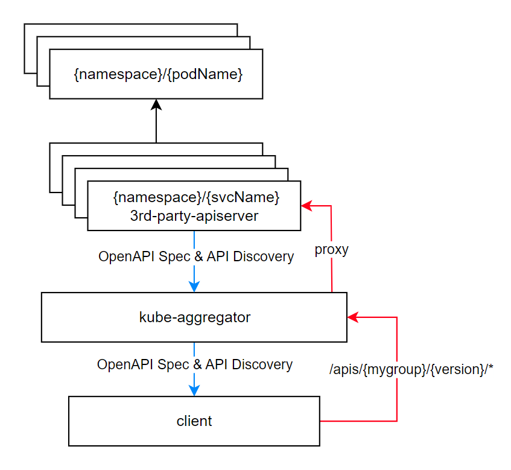

## Aggretation

1. kube-aggregator watch 所有 API 资源，三方 APIService 由 spec.service 解析成 `{name}.{namespace}:<port>`. Service 反向代理到后端 pod。
2. 启动 proxyHandler，反向代理三方 apiserver，转发 `/apis/{group}/{version}/*` 到对应的 apiserver 处理。
3. proxyHandler 聚合所有 OpenAPI Spec 到 `/openapi/v[2|3]` 。
4. 客户端通过 proxyHandler 访问 `/apis/{group}/{version}` 进行服务发现。
5. 对于**内置 API GroupVersion** `/api/*` & `/apis/*`，proxyHandler local flag 置位 true，**本地委托**给 kube-apiserver 进程处理。



```yaml
# 3rd-party APIServer spec example
apiVersion: apiregistration.k8s.io/v1
kind: APIService
metadata:
  name: v1alpha1.myservice.example.com
spec:
  # {namespace}/{service}/{port}
  service:
    name: myservice
    namespace: mynamespace
    port: 443
  group: myservice.example.com
  version: v1alpha1
  groupPriorityMinimum: 1000
  versionPriority: 15
  insecureSkipTLSVerify: true
  caBundle: <base64-encoded-ca-certificate>
```

## Handler Chain

[Filters/Middlewares](Filters/Middlewares) (AOP)

```bash
# Filter Chain
# +---------------+
# | panic recover |        +-- hello.zeng.dev-apiserver ---> /apis/hello.zeng.dev/**
# |   ↓           |        │
# | tracing       |        |  +--- metrics-apiserver ---> /apis/metmetrics.k8s.io/**
# |   ↓           |        |  │
# | log           |       remote
# |   ↓           |        ↑  ↑              group /apis/apiregistration.k8s.io/**
# | timeout       +---> kube-aggregator ---> /api/**, /apis/**, /openapi/v2, /openapi/v3/**
# |   ↓           |         ↓            
# |*authentication|        local
# |   ↓           |         │                       core/legacy group  /api/**
# | audit         |         └── kube-apiserver ---> official groups   [/apis/apps/**, /apis/batch/**, ...]
# |   ↓           |                 ↓
# | impersonation |              delegate
# |   ↓           |                 │
# | flowControl   |                 └── apiextensions-apiserver ---> CRD groups            /apis/apiextensions.k8s.io/**
# |   ↓           |                         ↓                        cutsomresource groups /apis/{crd.group}/**
# |*authorization |                      delegate
# +---------------+                         │
#                                           └── notfoundhandler ---> 404 NotFound
```

## [AuthN](https://github.com/kubernetes/website/blob/2c3355839f6b475cd6a2e8faeb4015324f7d447f/content/en/docs/reference/access-authn-authz/authentication.md)

客户端可以通过以下 2 种方式访问 3rd-party-apiserver

1. 直接访问

2. kube-aggregator 反向代理（通过了 Filter Chain），++Headers，分别对应 kube-apiserver [flags](https://kubernetes.io/docs/reference/command-line-tools-reference/kube-apiserver/):

| Header                 | kube-apiserver [Flag](https://kubernetes.io/docs/reference/command-line-tools-reference/kube-apiserver/) |
| ---------------------- | ------------------------------------------------------------ |
| `X-Remote-User`        | `--requestheader-username-headers`                           |
| `X-Remote-Group`       | `--requestheader-group-headers`                              |
| `X-Remote-Extra-{key}` | `--requestheader-extra-headers-prefix`                       |

3rd-party-apiserver 需要验证请求是否来自 kube-aggregator 代理，对应 kube-apiserver [flags](https://kubernetes.io/docs/reference/command-line-tools-reference/kube-apiserver/):

- `--requestheader-client-ca-file` kube-aggregator 客户端 CA 证书
- `--requestheader-allowed-names` 证书 Common Name
- `--proxy-client-cert-file` kube-aggregator 客户端证书
- `--proxy-client-key-file` kube-aggregator 客户端私钥

证书/私钥集群启动前由生成，写入 configmap.

```bash
# client-ca-file
# requestheader-allowed-names
# requestheader-client-ca-file
# requestheader-extra-headers-prefix
# requestheader-group-headers
# requestheader-username-headers
$ kubectl get cm -n kube-system extension-apiserver-authentication -o yaml
```

[cluster]rolebinding to role，这样 3rd-party-apiserver 就能够访问到上述 configmap。

```bash
$ kubectl get role -n kube-system | grep extension
```

```yaml
apiVersion: rbac.authorization.k8s.io/v1
kind: Role
metadata:
  name: extension-apiserver-authentication-reader
  namespace: kube-system
rules:
- apiGroups:
  - ""
  resourceNames:
  - extension-apiserver-authentication
  resources:
  - configmaps
  verbs:
  - get
  - list
  - watch
```

**3rd-party-apiserver 先通过 CA 验证请求是否来自于 kube-aggregator，再验证 Comman Name 是否为 requestheader-allowed-names 之一，一旦验证通过，则从 `X-Remote-User/Group/Extra-*` 种提取用户信息，用于后续 AuthZ。**

## [AuthZ](https://github.com/kubernetes/website/blob/2c3355839f6b475cd6a2e8faeb4015324f7d447f/content/en/docs/reference/access-authn-authz/authorization.md#authorization-modes-authorization-modules)

验证 token 接口 `/apis/authorization.k8s.io/v1/subjectaccessreviews`

```bash
# AuthN whether serviceaccount hello/me can list /apis/mygroup.com/namespaces/default/foos
curl -v -X POST \
-H "Accept: application/yaml" \
-H "Content-Type: application/yaml" \
'https://10.96.0.1:443/apis/authorization.k8s.io/v1/subjectaccessreviews?timeout=10s' -d '
kind: SubjectAccessReview
apiVersion: authorization.k8s.io/v1
metadata: {}
spec:
  resourceAttributes:
    namespace: default
    verb: list
    group: mygroup.com
    version: v1
    resource: myresources
  user: system:serviceaccount:hello:me
  groups:
  - system:serviceaccounts
  - system:serviceaccounts:hello
  - system:authenticated
  uid: 7c34f861-56c5-491d-a69c-6826fcd8578d
status:
  allowed: false       # set true if AuthZ passed
'
```

3rd-party-apiserver 还需绑定权限，才能进行上述操作。

```bash
$ kubectl get clusterrole | grep system:auth
```

```yaml
apiVersion: rbac.authorization.k8s.io/v1
kind: ClusterRole
metadata:
  name: system:auth-delegator
rules:
- apiGroups:
  - authentication.k8s.io
  resources:
  - tokenreviews
  verbs:
  - create
- apiGroups:
  - authorization.k8s.io
  resources:
  - subjectaccessreviews
  verbs:
  - create
```

**若客户端直接访问 3rd-party-apiserver**，3rd-party-apiserver 会向 kube-apiserver 发送 TokenReview

kube-apiserver 提供了一个专供 AuthN 接口 `/apis/authentication.k8s.io/v1/tokenreviews` 查看 token 包含的 username/uid/groups.

```bash
$ curl -v -X POST \
-H "Accept: application/json" \
-H "Content-Type: application/json" \
https://10.96.0.1:443/apis/authentication.k8s.io/v1/tokenreviews -d '
{
  "apiVersion": "authentication.k8s.io/v1",
  "kind": "TokenReview",
  "spec": {
    "token": "your_token_here"
  }
}'
```

```json
{
  "apiVersion": "authentication.k8s.io/v1",
  "kind": "TokenReview",
  "spec": {
    "token": "your_token_here"
  },
  // info for AuthZ
    "status": {
    "username": "system:serviceaccount:hello:me",
    "uid": "685c1d52-ab61-49be-9228-a3fa1e839a77", 
    "groups": [ "system:serviceaccounts", "system:serviceaccounts:hello", "system:authenticated"] 
  }
}'
```

3rd-party-apiserver 获取到 username/uid/groups 构造 subjectaccessreviews 进行 AuthZ。