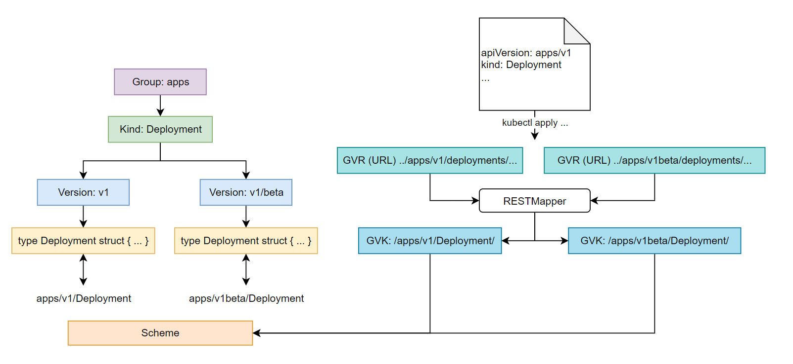

## VS

**GVR** stands for Group/Version/Resource

**GVK** stands for Group/Version/Kind

**编码时**，资源以 strcut 数据结构存储即 Go Type

- 由于多版本存在 v1/v1beata，不同 struct 存在差异，抽象出 Kind (single & list)
- **通过 GVK，能唯一标识一个 struct**
- 如何获取？**Scheme 维护/存储了 GVK → Go Type 的映射关系**

**创建资源时**，以 yaml/json 中的 apiversion & kind 对应 GVK

- 发送到 HTTP Path 对应 GVR
- **RESTMapper 实现 GVR → GVK**  

相同 Kind 可存在于不同组

- Ingress/NetworkPolicy in both `extensions` & `networking.k8s.io`
- Deployment in both `extensions` & `apps`

API 分组也体现在 REST API 路径上

- core   → `/api/VERSION`
- Others → `/apis/GROUPNAME/VERSION`

**API Version**: v1alpha → v1beta → v1 → ...

## Storage

K8s Resource Obj store as JSON/ProtoBuf in etcd.

Flag: `--storage-media-type`, default is `application/vnd.kubernetes.protobuf`.

