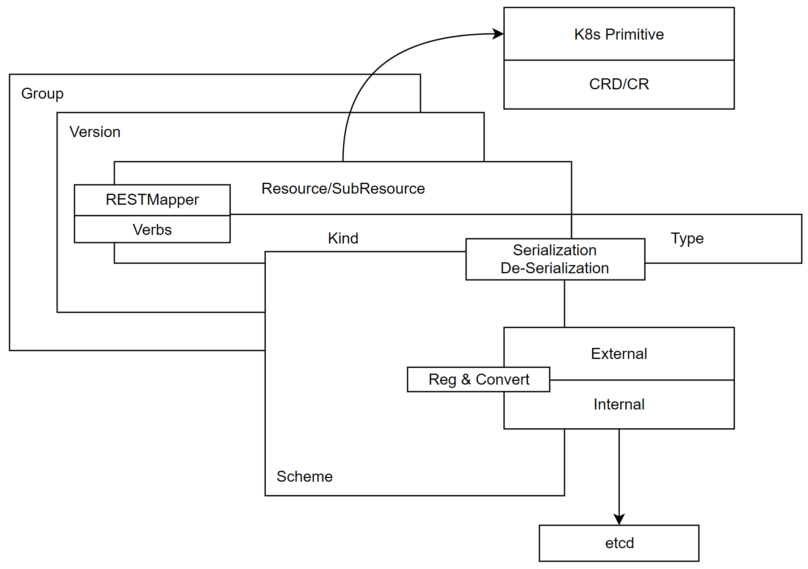
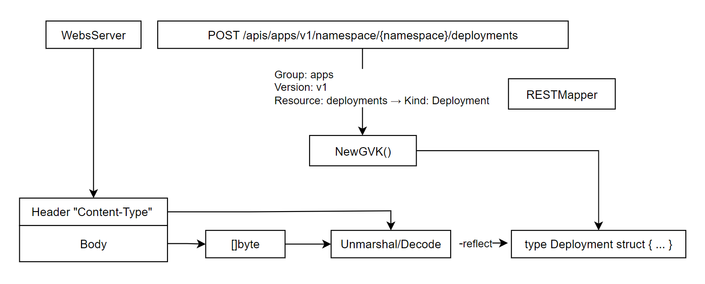

## Why versioning?

1. Evol with features newly added
2. ++**interval version** 同组内不同外部版本都会转换成一个内部版本再持久化，相当于一个聚合层 where
   - [External](https://github.com/kubernetes/kubernetes/tree/master/staging/src/k8s.io/api)
   - [Internal](https://github.com/kubernetes/api)

## Resouce Model

每个 Resource struct 通过组合成员变量构成，其中

- 组合 `metav1.TypeMeta` & `metav1.ObjectMeta` 提供类继承，可直接访问它们的字段和方法。
- 普通字段 `DeploymentSpec` & `DeploymentStatus`

```go
type Deployment struct {
    metav1.TypeMeta 
	metav1.ObjectMeta
    Spec DeploymentSpec
	Status DeploymentStatus
}
```

## Scheme



**scheme 是 K8s 资源管理的核心数据结构**。

- 注册 Resource Model Internal & External
- 将 GK 多个版本和内部版本进行转换
- 序列化/反序列化，识别 GVK，实例化 GVK

> RESTMapper + Scheme: GVR → GVK → `type ... struct { ... }`

**Group**: apps

**Version**: v1

**Resource**: deployments → Kind: Deployment

```bash
POST /apis/apps/v1/namespace/{namespace}/deployments
```

**如何将 GVK 映射成一个 type struct 呢？** map 即可

```go
type Scheme struct {
    gvkToType map[schema.GroupVersionKind]reflect.Type   // AddKnowType
    ...
}
```

**如何将 []byte 转换成一个内部对象呢？** 

HTTP header Content-Type 声明了内容的表述格式，HTTP Body 中包含了 []byte。

通过 GVK 构造函数实例化一个结构体，用于存储反序列化后的结果。



### Data Structure

维护 GVK 和 Resouce Model 对应关系，Resouce Model 和默认值函数的对应关系，不同版本和转换函数的对应关系。

```go
type Scheme struct {
	// GVK → Type
    gvkToType map[schema.GroupVersionKind]reflect.Type
    // Type → GVK
	typeToGVK map[reflect.Type][]schema.GroupVersionKind
	unversionedTypes map[reflect.Type]schema.GroupVersionKind
	unversionedKinds map[string]reflect.Type
	// GVK → label convert func
    fieldLabelConversionFuncs map[schema.GroupVersionKind]FieldLabelConversionFunc
	// type → convert func
    defaulterFuncs map[reflect.Type]func(interface{})
    // converter
	converter *conversion.Converter
	versionPriority map[string][]string
	observedVersions []schema.GroupVersion
    // scheme name
	schemeName string
}
```

### Implemented Interface

- `runtime.ObjectCreator` Resouce Model 创建
- `runtime.ObjectDefaulter` Resouce Model 赋默认值
- `runtime.ObjectConvert` Resouce Model 版本转换
- `runtime.ObjectTyper` Resouce Model 类型识别

### Registration

SchemeBuilder 负责完成 Resource Model 在 scheme 中的注册。

```go
// a list of func
type SchemeBuilder []func(*Scheme) error

// AddToScheme applies all the stored functions to the scheme.
func (sb *SchemeBuilder) AddToScheme(s *Scheme) error {
	for _, f := range *sb {
		if err := f(s); err != nil {
			return err
		}
	}
	return nil
}

// Register adds a scheme setup function to the list.
func (sb *SchemeBuilder) Register(funcs ...func(*Scheme) error) {
	for _, f := range funcs {
		*sb = append(*sb, f)
	}
}

// constrcutor
func NewSchemeBuilder(funcs ...func(*Scheme) error) SchemeBuilder {
	var sb SchemeBuilder
	sb.Register(funcs...)
	return sb
}
```

> External 注册 Resouce Module type，初始化/默认值，label，版本转换。

[staging/src/k8s.io/api/apps/v1/register.go](staging/src/k8s.io/api/apps/v1/register.go)

```go
// GV
const GroupName = "apps"
var SchemeGroupVersion = schema.GroupVersion{Group: GroupName, Version: "v1"}


var (
	// construct SchemeBuilder 
    SchemeBuilder      = runtime.NewSchemeBuilder(addKnownTypes)
	localSchemeBuilder = &SchemeBuilder
	AddToScheme        = localSchemeBuilder.AddToScheme
)

// reg all resource models given GV
func addKnownTypes(scheme *runtime.Scheme) error {
	scheme.AddKnownTypes(SchemeGroupVersion,
		&Deployment{},
		&DeploymentList{},
		&StatefulSet{},
		&StatefulSetList{},
		&DaemonSet{},
		&DaemonSetList{},
		&ReplicaSet{},
		&ReplicaSetList{},
		&ControllerRevision{},
		&ControllerRevisionList{},
	)
	metav1.AddToGroupVersion(scheme, SchemeGroupVersion)
	return nil
}
```

[pkg/apis/apps/v1/register.go](pkg/apis/apps/v1/register.go)

```go
// ref SchemeBuilder
var (
	localSchemeBuilder = &appsv1.SchemeBuilder
	AddToScheme        = localSchemeBuilder.AddToScheme
)

// call init to add default
func init() {
	localSchemeBuilder.Register(addDefaultingFuncs)
}
```

[pkg/apis/apps/v1/zz_generated.conversion.go](pkg/apis/apps/v1/zz_generated.conversion.go)

```go
// 
func RegisterConversions(s *runtime.Scheme) error {
    if err := s.AddConversionFunc(
        (*v1.Deployment)(nil), 
        (*apps.Deployment)(nil), 
        func(a, b interface{}, scope conversion.Scope) error {
		return Convert_v1_Deployment_To_apps_Deployment(
            a.(*v1.Deployment), 
            b.(*apps.Deployment), 
            scope)
	}); err != nil {
		return err
	}
}

if err := s.AddConversionFunc(
    (*apps.Deployment)(nil), 
    (*v1.Deployment)(nil), 
    func(a, b interface{}, scope conversion.Scope) error {
		return Convert_apps_Deployment_To_v1_Deployment(
            a.(*apps.Deployment), 
            b.(*v1.Deployment), 
            scope)
	}); err != nil {
		return err
	}
```

> Internal 只注册 Resource Model Type

```go
pkg/apis/apps/register.go

var (
	SchemeBuilder = runtime.NewSchemeBuilder(addKnownTypes)
	AddToScheme = SchemeBuilder.AddToScheme
)

// internal GV
const GroupName = "apps"
var SchemeGroupVersion = schema.GroupVersion{Group: GroupName, Version: runtime.APIVersionInternal}

// reg all resource models given GV
func addKnownTypes(scheme *runtime.Scheme) error {
	scheme.AddKnownTypes(SchemeGroupVersion,
		&DaemonSet{},
		&DaemonSetList{},
		&Deployment{},
		&DeploymentList{},
		&DeploymentRollback{},
		&autoscaling.Scale{},
		&StatefulSet{},
		&StatefulSetList{},
		&ControllerRevision{},
		&ControllerRevisionList{},
		&ReplicaSet{},
		&ReplicaSetList{},
	)
	return nil
}
```

