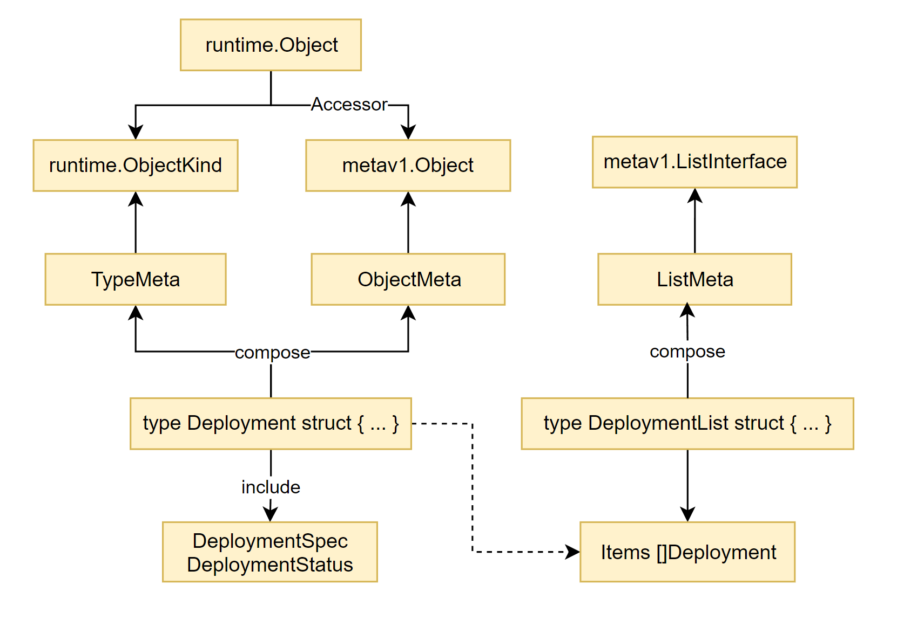

## metav1

> metav1.TypeMeta & metav1.ObjectMeta 是所有 API 单体对象的父类

```go
// External
// staging/src/k8s.io/api/core/v1/types.go
type Pod struct {
	metav1.TypeMeta
	metav1.ObjectMeta
	Spec PodSpec
	Status PodStatus
}
```

```yaml
# TypeMeta
apiVersion: v1
kind: Pod
# Object Meta
metadata:
  name: myapp-pod
  labels:
    app: myapp
# Spec
spec:
  containers:
  - name: mycontainer
    image: buxybox
    command: ['sh','-c','echo Hello && sleep 3600']
# Status
# To be filled by Controller
```

> metav1.TypeMeta & metav1.ListMeta 是所有 API 列表对象的父类

对象列表类型 `*List`

```go
// External
// staging/src/k8s.io/api/core/v1/types.go

type PodList struct {
	metav1.TypeMeta
	metav1.ListMeta
	Items []Pod
}
```



## TypeMeta

`TypeMeta` 类型属性描述。**基于 apiVersion + kind**。实现了 `ObjectKind` 接口。

Note: metav1 是 [k8s.io/apimachinery/pkg/apis/meta/v1](https://github.com/kubernetes/apimachinery/tree/master/pkg/apis/meta/v1) 重命名。

```go
// apimachinery/pkg/apis/meta/v1/types.go
type TypeMeta struct {
    Kind       string
    APIVersion string
}

// apimachinery/pkg/apis/meta/v1/meta.go
func (obj *TypeMeta) GetObjectKind() schema.ObjectKind { 
    return obj 
}
```

```go
// apimachinery/pkg/runtime/schema/interfaces.go
type ObjectKind interface {
	// GVK getter/setter
    SetGroupVersionKind(kind GroupVersionKind)
	GroupVersionKind() GroupVersionKind
}

// implemented ObjectKind interface
func (obj *TypeMeta) SetGroupVersionKind(gvk schema.GroupVersionKind) {
	obj.APIVersion, obj.Kind = gvk.ToAPIVersionAndKind()
}
func (obj *TypeMeta) GroupVersionKind() schema.GroupVersionKind {
	return schema.FromAPIVersionAndKind(obj.APIVersion, obj.Kind)
}
```

## ObjectMeta

每个 API 对象 meta，比如 name/namespace/label/annotation/uid。实现 `Object` 接口。

```go
// apimachinery/pkg/apis/meta/v1/types.go
type ObjectMeta struct {
    Name                       string               // namespace uniqueness
    GenerateName               string               // gen if Name is nil
    Namespace                  string               // namespace
    SelfLink                   string               // Deprecated!!!
    UID                        types.UID            // unique id
    ResourceVersion            string               // optimistic lock
    Generation                 int64                // generatation of desired state
    CreationTimestamp          Time                 // creation time
    DeletionTimestamp          *Time                // deletion time, auto-gen
    DeletionGracePeriodSeconds *int64               // # of sec allowed for obj to gracefully terminate
    Labels                     map[string]string    // label K/V
    Annotations                map[string]string    // annotation K/V
    OwnerReferences            []OwnerReference     // depended by
    Finalizers                 []string             // cleanup tasks before object is removed from etcd
    ManagedFields              []ManagedFieldsEntry // server apply
}
```

```go
// apimachinery/pkg/apis/meta/v1/meta.go
func (obj *ObjectMeta) GetObjectMeta() Object { return obj }

// impl 
type ObjectMetaAccessor interface {
	GetObjectMeta() Object
}
```

```go
// apimachinery/pkg/apis/meta/v1/meta.go
// getter/setter for fields
func (meta *ObjectMeta) GetNamespace() string                { return meta.Namespace }
func (meta *ObjectMeta) SetNamespace(namespace string)       { meta.Namespace = namespace }
...

// apimachinery/pkg/apis/meta/v1/meta.go
type Object interface {
    GetNamespace() string
	SetNamespace(namespace string)
    ...
}
```

## ListMeta

```go
type ListMeta struct {
	SelfLink           string // Deprecated!!!
	ResourceVersion    string // optimistic lock
	Continue           string // paginating
	RemainingItemCount *int64 // leftover
}
```

```go
// apimachinery/pkg/apis/meta/v1/meta.go
// getter/setter for fields
func (meta *ListMeta) GetResourceVersion() string        { return meta.ResourceVersion }
func (meta *ListMeta) SetResourceVersion(version string) { meta.ResourceVersion = version }
func (meta *ListMeta) GetSelfLink() string               { return meta.SelfLink }
func (meta *ListMeta) SetSelfLink(selfLink string)       { meta.SelfLink = selfLink }
func (meta *ListMeta) GetContinue() string               { return meta.Continue }
func (meta *ListMeta) SetContinue(c string)              { meta.Continue = c }
func (meta *ListMeta) GetRemainingItemCount() *int64     { return meta.RemainingItemCount }
func (meta *ListMeta) SetRemainingItemCount(c *int64)    { meta.RemainingItemCount = c }


// apimachinery/pkg/apis/meta/v1/meta.go
type ListInterface interface {
	GetResourceVersion() string
	SetResourceVersion(version string)
	GetSelfLink() string
	SetSelfLink(selfLink string)
	GetContinue() string
	SetContinue(c string)
	GetRemainingItemCount() *int64
	SetRemainingItemCount(c *int64)
}
```

## Object

可以理解为 `runtime.Object` 是对 `schema.ObjecKind` 和 `metav1.Object ` 两个接口进行了封装。

所有 API 对象都实现了 `runtime.Object` 该接口，即可对自身的 Type & Meta 进行操作。

Note: `metav1.Object` 可通过 `Accessor()` 函数获取。

```go
type Object interface {
	GetObjectKind() schema.ObjectKind
	DeepCopyObject() Object
}
```

