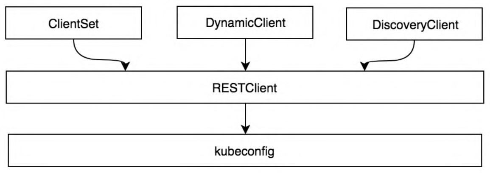

[client-go](https://github.com/kubernetes/client-go) a lib to talk wiath K8s API Server (by **kubeconfig**)，perform CRUD on API obj。

client-go 提供 **informer 机制**将 controller 需要的资源变化传递给 controller。

[K8s API Overview](https://kubernetes.io/docs/reference/generated/kubernetes-api/v1.31/#) → Good Practice

## Types

**RESTClient**：最基础的客户端，封装 HTTP Request，实现了 RESTful-sytle API。

**ClientSet**：Client集，封装了对每个 Resource/Version 的管理，只能操作 built-in 资源，由 client-gen 生成。

**DynamicClient**：能额外处理 CRD。

**DiscoveryClient**：发现 API Server 所支持的 GVR。



### [RESTClient](https://xinchen.blog.csdn.net/article/details/113487087)

client-go 最基础的客户端，封装 HTTP Request，实现了 RESTful-sytle API :cry: 但只能指定一种 GVK，且需要手动配置。

1. 确定要操作的资源类型，去 API 文档找对应的 Path & 字段信息。
2. 加载 kubeconfig
3. 创建资源对象
4. 创建 RESTClient 实例，传入 kubeconfig
5. 调用 RESTClient 向 API Server 发起请求

```go
config, err := getConfigOnDisk()

// build rest client
restClient, err := rest.RESTClientFor(config)

// send get request
result := restClient.Get().Namespace("default").Resource("pods").Do()

// iter
for _, item := range result.Items {
	fmt.Printf("%v\t %v\t %v\n",
		item.Namespace,
		item.Status.Phase,
		item.Name)
}
```


```go
// build clientset from kubeconfig
config, err := getConfigOnDisk()
clientset, err := kubernetes.NewForConfig(config)

// get rest client from clientset
req := restClient.Get().
		Namespace("kube-system").
		Resource("pods").
		SetHeader(
			"Accept",
			fmt.Sprintf(
				"application/json;as=Table;v=%s;g=%s",
				metav1.SchemeGroupVersion.Version,      // set G/V
				metav1.GroupName,
			),
		)

var res metav1.Table
err = req.Do(ctx).Into(&res)

// tab writer to format
w := tabwriter.NewWriter(os.Stdout, 0, 0, 1, ' ', tabwriter.Debug)

// col header
for _, colDef := range res.ColumnDefinitions {
	_, _ = fmt.Fprintf(w, "%v\t", colDef.Name)
}
_, _ = fmt.Fprintln(w, "")

// cell per row
for _, row := range res.Rows {
	for _, cell := range row.Cells {
		_, _ = fmt.Fprintf(w, "%v\t", cell)
	}
	_, _ = fmt.Fprintln(w, "")
}

// flush buffer to output
err = w.Flush()
```

### ClientSet

Clientset 是多个 G/V client 的集合；结构体**内嵌**了多个 GVK client。

1. 创建 clientset 实例
2. 从 clientset 中获取对应 GVK 的客户端
3. 构建请求并发送

```go
type Clientset struct {
	*discovery.DiscoveryClient
	...
	appsV1                        *appsv1.AppsV1Client
	...
    // config.GroupVersion = &corev1.SchemeGroupVersion
    // restClient, err := rest.RESTClientFor(config)
	coreV1                        *corev1.CoreV1Client
    ...
}
```

```go
clientset, _ := kubernetes.NewForConfig(config)

wantedPod := corev1.Pod{
	ObjectMeta: metav1.ObjectMeta{
		Name: "nginx-pod",
		Labels: map[string]string{
			"myKey": "myVal",
		},
	},
	Spec: corev1.PodSpec{
		Containers: []corev1.Container{
			{
				Name:  "nginx",
				Image: "nginx",
			},
		},
	},
}

createdPod, err := clientset.CoreV1().Pods("default").Create(ctx, &wantedPod, metav1.CreateOptions{})
if err != nil {
	if errors.IsNotFound(err) {
		fmt.Printf("Namespace %q not found\n", "project1")
		os.Exit(1)
	} else if errors.IsAlreadyExists(err) {
		fmt.Printf("Pod %q already exists\n", "nginx-pod")
		os.Exit(1)
	} else if errors.IsInvalid(err) {
		fmt.Printf("Pod specification is invalid\n")
		os.Exit(1)
	}
	panic(err)
}
_ = createdPod
return createdPod, err
```

### DynamicClient

资源对象 GVR 对应具体的数据结构 GVK in struct。所有的 GVK 都实现了 Object.runtime 接口 = 顶级父类。

```go
// staging/src/k8s.io/apimachinery/pkg/runtime/interfaces.go
type Object interface {
	GetObjectKind() schema.ObjectKind
	DeepCopyObject() Object
}
```

Unstructured 非结构体，通用的 API 对象表示方式。

基于 interface{} **反射**，可动态处理未知资源类型，无需提前定义结构体。

支持与 GVK 相互转换。

```go
type Unstructured struct {
	// Object is a JSON compatible map with string, float, int, bool, []interface{}, or map[string]interface{}
	Object map[string]interface{}
}
```

```go
pod := Pod{
	Name:      "my-pod",
	Namespace: "default",
}

// pod → podUnstructured
podUnstructured, err := scheme.Scheme().FromUnstructured(pod)
// podUnstructured → pod
convertedPod := Pod{}
err = scheme.Scheme().FromUnstructured(podUnstructured, &convertedPod)
```

**为什么需要动态客户端？** 对于原生 GVK，clientset 完美解决 but CRD/CR ... 

对于不支持的资源对象可以交给 Unstructured 由 DynamicClient 处理。

```go
// 内嵌一个 rest client
type dynamicClient struct {
	client *rest.RESTClient
}

// 只有一个方法，传参指定了本次操作的资源类型
func (c *dynamicClient) Resource(resource schema.GroupVersionResource) NamespaceableResourceInterface {
	return &dynamicResourceClient{client: c, resource: resource}
}
```

```go
client, err := dynamic.NewForConfig(config)

// create unstructured deployment
deployment := &unstructured.Unstructured{
	Object: map[string]interface{}{
		"apiVersion": "apps/v1",
		"kind":       "Deployment",
		"metadata": map[string]interface{}{
			"name": "example-deployment",
		},
		"spec": map[string]interface{}{
			"replicas": 1,
			"selector": map[string]interface{}{
				"matchLabels": map[string]interface{}{
					"app": "example",
				},
			},
			"template": map[string]interface{}{
				"metadata": map[string]interface{}{
					"labels": map[string]interface{}{
						"app": "example",
						},
					},
				"spec": map[string]interface{}{
					"containers": []map[string]interface{}{
						{
							"name":  "nginx",
							"image": "nginx:latest",
						},
					},
				},
			},
		},
	},
}

// create deployment
createdDeployment, err := client.Resource(schema.GroupVersionResource{
	Group:    "apps",
	Version:  "v1",
	Resource: "deployments",
}).Namespace("default").Create(context.TODO(), deployment, metav1.CreateOptions{})

// list
deployments, err := client.Resource(schema.GroupVersionResource{
	Group:    "apps",
	Version:  "v1",
	Resource: "deployments",
}).Namespace("default").List(context.TODO(), metav1.ListOptions{})
```

### DiscoveryClient

RESTClient/Clientset/DynamicClient 面向资源对象

DiscoveryClient 面向 GVR 访问 `/apis`

```go
dc, err := discovery.NewDiscoveryClientForConfig(config)

apiResources, err := dc.ServerPreferredResources()
for _, apiResourceList := range apiResources {
	for _, apiResource := range apiResourceList.APIResources {
		fmt.Printf("Group: %s, Version: %s, Resource: %s\n", 
                   apiResourceList.GroupVersion, 
                   apiResource.Version, 
                   apiResource.Name)
	}
}
```

```bash
# 基于 DiscoveryClient
$ kubectl api-versions
```

```go
type APIVersionsOptions struct {
	// cache avoid freq poll from API Server
    discoveryClient discovery.CachedDiscoveryInterface
	genericclioptions.IOStreams
}
```

