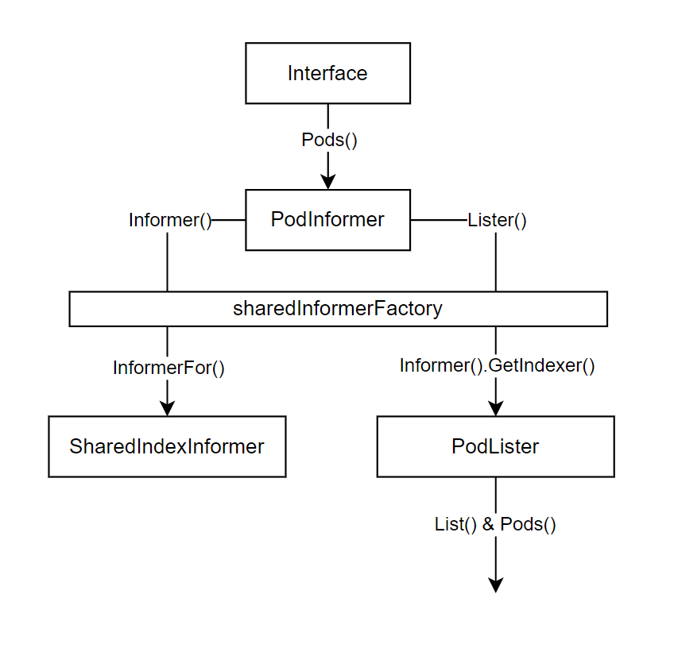
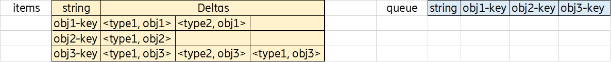
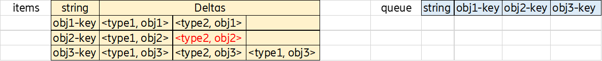
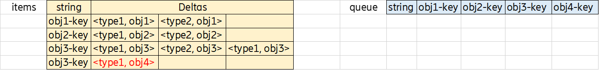

## Overview

**K8s 对于每一各内建资源/对象，都有对应的 *Informer 接口**，包含：

- **Informer** SharedIndexInformer 一种高效的、分布式的缓存机制，用于监视和响应 Kubernetes API 资源的变化
- **Lister** 提供 List 和 Get 方法，能够按照 selector 和 namespace/name 按需获取对应的资源。

```go
// client-go/blob/master/informers/core/v1/pod.go
type PodInformer interface {
	Informer() cache.SharedIndexInformer
	Lister() v1.PodLister
}

// client-go/listers/core/v1/pod.go
type PodLister interface {
    List(selector labels.Selector) (ret []*v1.Pod, err error)
    Pods(namespace string) PodNamespaceLister
    PodListerExpansion
}
```

> 为什么需要 Informer 机制？

在不依赖任何中间件的情况下，保证 K8s 组件间消息的实时性、可靠性、顺序性。

> Informer 如何实现？

学习：框架 → 各组件 → 源码；

核心：数据同步流向

## Informer

从开发者的角度，只需注重逻辑调用：

1. 在对应 informer 上调用 `AddEventHandler` 添加逻辑处理。
2. 实现 worker 从 workqueue 种消费 obj-key 即可。

而其他所有数据的存储/同步/分发，都由 [client-go](https://github.com/kubernetes/client-go) 完成：

SharedIndexInformer 提供资源监视/本地缓存/事件通知/共享机制。

- Controller 核心中枢
  - [Reflector](https://github.com/k8s-club/k8s-club/blob/main/articles/Informer机制 - 概述.md#Reflector) 通过 ListAndWatch 实现本地和 API Server 数据同步
    - [DeltaFIFO](https://github.com/k8s-club/k8s-club/blob/main/articles/Informer机制 - 概述.md#DeltaFIFO) 存储待处理的 obj (delta)，存储**最新**数据，提供 verb 方法以及 relist 的 replace 方法


- [Indexer](https://github.com/k8s-club/k8s-club/blob/main/articles/Informer机制 - 概述.md#indexerlocal-store) 存储最全数据，提供索引功能

- [HandleDeltas](https://github.com/k8s-club/k8s-club/blob/main/articles/Informer机制 - 概述.md#HandleDeltas-方法) 消费 DeltaFIFO 中的 obj (delta)，更新 Indexer，通过 distribute 方法分发给 Listener & workqueue
- [workqueue](https://github.com/k8s-club/k8s-club/blob/main/articles/Informer机制 - 概述.md#workqueue) 存放 obj(key) 待 worker 处理

```go
// client-go/tools/cache/shared_informer.go
type sharedIndexInformer struct {
    indexer                        Indexer          // local store
    controller                     Controller       // reflector + delataFIFO
    processor                      *sharedProcessor // handleDelta
    cacheMutationDetector          MutationDetector
    listerWatcher                  ListerWatcher
    objectType                     runtime.Object   // type of obj expect to handle
    objectDescription              string
    resyncCheckPeriod              time.Duration
    defaultEventHandlerResyncPeriod time.Duration
    clock                          clock.Clock
    started, stopped               bool              // flag of controller state
    startedLock                    sync.Mutex
    blockDeltas                    sync.Mutex        // 
    watchErrorHandler              WatchErrorHandler
    transform                      TransformFunc
}

```

### Controller

Controller 以 goroutine 执行 Run，从而启动 Reflector 从 API Server 拉取全量 & 监听增量，保存到 DeltaFIFO。启动 processLoop 不断从 DeltaFIFO 中 Pop 进行消费。

```go
// client-go/tools/cache/controller.go
type Controller interface {
	
	Run(stopCh <-chan struct{})

	// HasSynced delegates to the Config's Queue
	HasSynced() bool

	// LastSyncResourceVersion delegates to the Reflector when there
	// is one, otherwise returns the empty string
	LastSyncResourceVersion() string
}

type controller struct {
	config         Config          
	reflector      *Reflector    // ListAndWatch
	reflectorMutex sync.RWMutex
	clock          clock.Clock
}

func (c *controller) Run(stopCh <-chan struct{}) {
	defer utilruntime.HandleCrash()
	go func() {
		<-stopCh
		c.config.Queue.Close()
	}()
	
    // build reflector with option
    r := NewReflectorWithOptions(
		c.config.ListerWatcher,
		c.config.ObjectType,
		c.config.Queue,
		ReflectorOptions{
			ResyncPeriod:    c.config.FullResyncPeriod,
			MinWatchTimeout: c.config.MinWatchTimeout,
			TypeDescription: c.config.ObjectDescription,
			Clock:           c.clock,
		},
	)
	r.ShouldResync = c.config.ShouldResync
	r.WatchListPageSize = c.config.WatchListPageSize
	if c.config.WatchErrorHandler != nil {
		r.watchErrorHandler = c.config.WatchErrorHandler
	}

	c.reflectorMutex.Lock()
	c.reflector = r
	c.reflectorMutex.Unlock()

	var wg wait.Group

	wg.StartWithChannel(stopCh, r.Run)

    // processLoop is HandleDelta
    // 1. pop from DeltaFIFO
    // 2. update Indexer
    // 3. distribute to listeners & workqueue
	wait.Until(c.processLoop, time.Second, stopCh)
	wg.Wait()
}

func (c *controller) processLoop() {
	for {
		// dequeue from DeltaFIFO
        obj, err := c.config.Queue.Pop(PopProcessFunc(c.config.Process))
		if err != nil {
			if err == ErrFIFOClosed {
				return
			}
			if c.config.RetryOnError {
				// This is the safe way to re-enqueue.
				c.config.Queue.AddIfNotPresent(obj)
			}
		}
	}
}
```

### Shared Mechanism

对于同一个资源，比如 Pod，会存在多个 Listener 去关心它的变化，如果每个都实例化 Informer，冗余 List/Watch，API Server 压力 ↑

Singleton 单例模式，提供公有 GetSingleton 方法获取 Informer 实例，所有 Listener 共享该实例。

```go
// client-go/informers/factory.go

// 所有的 Informer 都通过同一个工厂 SharedInformerFactory 来生成
type sharedInformerFactory struct {
	...
	// 工厂级别(所有 informer)默认的 resync 时间
	defaultResync    time.Duration
	// 每个 informer 具体的 resync 时间
	customResync     map[reflect.Type]time.Duration
	// map 保存所有已实例化的 informer
	informers        map[reflect.Type]cache.SharedIndexInformer
    ...
}

// 共享机制通过 InformerFor 来完成，基于 Singleton
func (f *sharedInformerFactory) InformerFor(
	obj runtime.Object, 
	newFunc internalinterfaces.NewInformerFunc,
) cache.SharedIndexInformer {
	...
	informerType := reflect.TypeOf(obj)
	// 如果 map 中已有 informer 实例 直接返回
	informer, exists := f.informers[informerType]
	if exists {
		return informer
	}
	// 若 map 中不存在实例
	// 1. 设置 informer 的 resync 时间
	resyncPeriod, exists := f.customResync[informerType]
	if !exists {
		resyncPeriod = f.defaultResync
	}
	// 2. 实例化 informer
	informer = newFunc(f.client, resyncPeriod)
	// 3. 写入 map
	f.informers[informerType] = informer

	return informer
}
```

**K8s 对于每一各内建资源/对象，都有对应的 *Informer 接口**，Example: **PodInformer**

```go
// client-go/informers/core/v1
type Interface interface {
	...
    // Pods returns a PodInformer.
	Pods() PodInformer
	...
}

// 通过 Pods 实例化 podInformer，传入 factory
func (v *version) Pods() PodInformer {
	return &podInformer{factory: v.factory, namespace: v.namespace, tweakListOptions: v.tweakListOptions}
}

// client-go/blob/master/informers/core/v1/pod.go
// podInformer: Informer + Lister
type PodInformer interface {
	Informer() cache.SharedIndexInformer
	Lister() v1.PodLister
}
// 工厂获取 SharedIndexInformer 实例
func (f *podInformer) Informer() cache.SharedIndexInformer {
	return f.factory.InformerFor(&corev1.Pod{}, f.defaultInformer)
}
// 工厂获取 Indexer，实例化 PodLister，提供 List & Pods 方法
func (f *podInformer) Lister() v1.PodLister {
	return v1.NewPodLister(f.Informer().GetIndexer())
}

type PodLister interface {
    List(selector labels.Selector) (ret []*v1.Pod, err error)
    Pods(namespace string) PodNamespaceLister
    PodListerExpansion
}
```



### Reflector

每一个 Informer 内嵌一个 Reflector 负责监控对应的资源；当资源发生变化时，会触发相应 obj 的变更事件，并将该 obj 的 **Delta** 放入 DeltaFIFO 中。

**ListAndWatch**: list (full) → resync → watch (increment)

```go
// client-go/tools/cache/listwatch.go
type ListerWatcher interface {
	Lister
	Watcher
}

type Lister interface {
    List(options metav1.ListOptions) (runtime.Object, error)
}

type Watcher interface {
    Watch(options metav1.ListOptions) (watch.Interface, error)
}

// client-go/tools/cache/reflector.go
func (r *Reflector) ListAndWatch(stopCh <-chan struct{}) error { 
	// list
	...
	// resync
	...
	// watch
	...
}

func (r *Reflector) Run(stopCh <-chan struct{}) {
	...
    // recover
	wait.BackoffUntil(func() {
		if err := r.ListAndWatch(stopCh); err != nil {
			r.watchErrorHandler(r, err)
		}
	}, r.backoffManager, true, stopCh)
	...
}
```

#### List

只运行一次。

1. 启一个 goroutine 去 API Server 拉取最新的 obj 集合。
2. 等待 goroutine 结束，listCh 接收到信号，表示 list 完成。或者 stopCh、panicCh 发来信号。
3. 获取 GV & list item = []runtime.Object，然后进行同步。
4. 调用 DeltaFIFO Replace 方法将 list item 入队。

```go
func (r *Reflector) list(stopCh <-chan struct{}) error {
    ...
    var list runtime.Object
    listCh := make(chan struct{}, 1)
	panicCh := make(chan interface{}, 1)
	
    // 1. 启一个 goroutine 去 API Server 拉取最新的 obj 集合
    go func() {
		defer func() {
			if r := recover(); r != nil {
				panicCh <- r
			}
		}()
		// Attempt to gather list in chunks
		pager := pager.New(pager.SimplePageFunc(func(opts metav1.ListOptions) (runtime.Object, error) {
			return r.listerWatcher.List(opts)
		}))
		...
		list, paginatedResult, err = pager.ListWithAlloc(context.Background(), options)
		...
        // mark list done
		close(listCh)
        ...
	}()
    // 2. 等待 goroutine 结束，listCh 接收到信号，表示 list 完成。或者 stopCh、panicCh 发来信号。
    select {
		case <-stopCh:
			return nil
		case r := <-panicCh:
			panic(r)
		case <-listCh:
	}
    // 3. 获取 GV & list item = []runtime.Object，然后进行同步
    listMetaInterface, err := meta.ListAccessor(list)
    resourceVersion = listMetaInterface.GetResourceVersion()
    items, err := meta.ExtractListWithAlloc(list)
    if err := r.syncWith(items, resourceVersion); err != nil {
		return fmt.Errorf("unable to sync list result: %v", err)
	}
    
}

func (r *Reflector) syncWith(items []runtime.Object, resourceVersion string) error {
	found := make([]interface{}, 0, len(items))
	for _, item := range items {
		found = append(found, item)
	}
    // 4. DelataFIFO, enqueue obj
	return r.store.Replace(found, resourceVersion)
}
```

```go
// client-go/tools/cache/dealta_fifo.go
func (f *DeltaFIFO) Replace(list []interface{}, _ string) error {
    ...
    // 1. 将 list 中的所有 obj，通过 queueActionInternalLocked 添加状态为 Replaced 的 Delta
    for _, item := range list {
		key, err := f.KeyOf(item)
		if err != nil {
			return KeyError{item, err}
		}
		keys.Insert(key)
		if err := f.queueActionInternalLocked(action, Replaced, item); err != nil {
			return fmt.Errorf("couldn't enqueue object: %v", err)
		}
	}
    ...
    // 2. 找出在本地需要删除的 obj，添加状态为 Deleted 的 Delta.
    queuedDeletions := 0
	for k, oldItem := range f.items {
		if keys.Has(k) {
			continue
		}
		var deletedObj interface{}
		if n := oldItem.Newest(); n != nil {
			deletedObj = n.Object
			if d, ok := deletedObj.(DeletedFinalStateUnknown); ok {
				deletedObj = d.Obj
			}
		}
		queuedDeletions++
		if err := f.queueActionLocked(Deleted, DeletedFinalStateUnknown{k, deletedObj}); err != nil {
			return err
		}
	}
    
}
```

#### Resync

Between **DeltaFIFO** and **Indexer** (local store)

```go
// startResync periodically calls r.store.Resync() method.
func (r *Reflector) startResync(stopCh <-chan struct{}, cancelCh <-chan struct{}, resyncerrc chan error) {
	// resyncChan() 定期向 resyncCh 发送信号，由 resyncPeriod 属性来设置
    resyncCh, cleanup := r.resyncChan()
	defer func() {
		cleanup()
	}()
	// infinite loop 
    for {
		select {
		case <-resyncCh:  // 上层(调用者)发来停止信号
		case <-stopCh:
			return
		case <-cancelCh:  // 本次 ListAndWatch 结束
			return
		}
		// should resyncs?
        if r.ShouldResync == nil || r.ShouldResync() {
			klog.V(4).Infof("%s: forcing resync", r.name)
			// DeltaFIFO Resync
            if err := r.store.Resync(); err != nil {
				resyncerrc <- err
				return
			}
		}
		cleanup()
		// resyncChan() 定期向 resyncCh 发送信号，由 resyncPeriod 属性来设置
        resyncCh, cleanup = r.resyncChan()
	}
}
```

调用 `sharedProcessor.ShouldResync() `

```go
// client-go/tools/cache/shared_informer.go
func (p *sharedProcessor) shouldResync() bool {
	p.listenersLock.Lock()
	defer p.listenersLock.Unlock()

	resyncNeeded := false
	now := p.clock.Now()
	for listener := range p.listeners {
		// 遍历所有 listener 看是否需要进行 resync，根据每一个 listen 的同步时间
        // map[listener]bool
		shouldResync := listener.shouldResync(now)
		p.listeners[listener] = shouldResync

		if shouldResync {
			resyncNeeded = true
            // 计算下一次 resync 时间
			listener.determineNextResync(now)
		}
	}
	return resyncNeeded
}
```

调用 `store.Resync()` 同步本地之间的 obj 信息，DeltaFIFO 一定是最新的数据，后续经过处理还会被更新到 Index 中，所以不需要再添加 DeltaFIFO。

```go
// client-go/tools/cache/delta_fifo.go
func (f *DeltaFIFO) Resync() error {
	f.lock.Lock()
	defer f.lock.Unlock()

	if f.knownObjects == nil {
		return nil
	}

	// 将 Indexer 中的 obj 全部刷到 DeltaFIFO 中
    keys := f.knownObjects.ListKeys()
	for _, k := range keys {
		if err := f.syncKeyLocked(k); err != nil {
			return err
		}
	}
	return nil
}

func (f *DeltaFIFO) syncKeyLocked(key string) error {
	// 通过 key 在 Indexer 中获得 obj
	obj, exists, err := f.knownObjects.GetByKey(key)
	...
	// 计算 DeltaFIFO 中 Obj 的 key
	id, err := f.KeyOf(obj)
	...
	// 如果在 items 中已经存在该 obj，就不需要再添加了
	if len(f.items[id]) > 0 {
		return nil
	}
	// 若无，则添加 Sync 类型的 Deltas
	if err := f.queueActionLocked(Sync, obj); err != nil {
		return fmt.Errorf("couldn't queue object: %v", err)
	}
	return nil
}
```

#### Watch

通过 `handleWatch()` 函数来实现，其内部循环监听 watch 对象。

通过**反射**，根据类型处理 Added/Modified/Deleted/Bookmard，分别对应 Obj 添加/修改/删除/版本更新。

分别调用 DeletaFIFO Add/Update/Delete 方法，向 DeltaFIFO 中添加 DeltaType `Added、Updated、Deleted` 的 Delta，后续 HandleDeltas 通过 Pop 进行消费。

```go
// client-go/tools/cache/reflector.go
func (r *Reflector) watch(w watch.Interface, stopCh <-chan struct{}, resyncerrc chan error) error {
    for {
		...
		if w == nil {
			...
			w, err = r.listerWatcher.Watch(options)
			...
		}
		err = handleWatch(start, w, r.store, r.expectedType, r.expectedGVK, r.name, r.typeDescription, r.setLastSyncResourceVersion,
			r.clock, resyncerrc, stopCh)
		...
	}
}

func handleAnyWatch ...
select {
    case event, ok := <-w.ResultChan():
    	switch watch.Added:
    		...
    	switch watch.Modified:
    		...
}
```

```go
// client-go/tools/cache/delta_fifo.go
func (f *DeltaFIFO) Add(obj interface{}) error { ... }
func (f *DeltaFIFO) Update(obj interface{}) error { ... }
func (f *DeltaFIFO) Delete(obj interface{}) error { ... }
```

### DeltaFIFO

生产/消费队列，作为远端 API Server 和本地 Indxer/Listeners & Workqueue 桥梁。

操作的资源对象 `Delta`，每一个 `Delta` 包含一个操作类型和操作对象。

**queueActionLocked**

```go
// client-go/tools/cache/delta_fifo.go
type DeltaFIFO struct {
	// lock/cond protects access to 'items' and 'queue' for concurrency control
	lock sync.RWMutex
	cond sync.Cond

    // `items` maps a key to a Deltas (at least one Delta).
	items map[string]Deltas

	// `queue` maintains FIFO order of keys for consumption in Pop().
	// There are no duplicates in `queue`.
	// A key is in `queue` if and only if it is in `items`.
	queue []string

	// populated is true if the first batch of items inserted by Replace() has been populated
	// or Delete/Add/Update/AddIfNotPresent was called first.
	populated bool
	// initialPopulationCount is the number of items inserted by the first call of Replace()
	initialPopulationCount int

	// keyFunc is used to make the key used for queued item
	// insertion and retrieval, and should be deterministic.
	keyFunc KeyFunc

	// knownObjects list keys that are "known" --- affecting Delete(), Replace(), and Resync()
    // knownObjects ≈ Indexer
	knownObjects KeyListerGetter

	// Used to indicate a queue is closed so a control loop can exit when a queue is empty.
	// Currently, not used to gate any of CRUD operations.
	closed bool

	// emitDeltaTypeReplaced is whether to emit the Replaced or Sync
	// DeltaType when Replace() is called (to preserve backwards compat).
	emitDeltaTypeReplaced bool

	// Called with every object if non-nil.
	transformer TransformFunc
}
```

```go
type DeltaType string

// Change type definition
const (
	Added   DeltaType = "Added"
	Updated DeltaType = "Updated"
	Deleted DeltaType = "Deleted"
	// Replaced is emitted when we encountered watch errors and had to do a
	// relist. We don't know if the replaced object has changed.
	Replaced DeltaType = "Replaced"
	// Sync is for synthetic events during a periodic resync.
	Sync DeltaType = "Sync"
)
```

最主要的两个存储结构

**queue**

- 存储 obj-key。
- 有序，保证消费时顺序。
- 与 items 中的 key 对应。

**items**

- 存储 []Deltas，至少一个 Delta
- 每一个 Delta 包含 obj & type
  - 对象 & 操作类型（Added/Updated/Deleted/Replaced = 重新 list 因 watch event 出错/Sync 本地同步）



#### Push

```go
// client-go/tools/cache/delta_fifo.go
func (f *DeltaFIFO) queueActionLocked(actionType DeltaType, obj interface{}) error {
	return f.queueActionInternalLocked(actionType, actionType, obj)
}

func (f *DeltaFIFO) queueActionInternalLocked(actionType, internalActionType DeltaType, obj interface{}) error {
	// 1. 通过 `KeyOf `计算得到 obj 对应的 key
    id, err := f.KeyOf(obj)
	...
	// 2. 通过 key 取 items 中的元素 OldDeltas，同时将当前的 delta{DeltaType,Obj} append 进去，得到 newDeltas
	oldDeltas := f.items[id]
	newDeltas := append(oldDeltas, Delta{actionType, obj})
	// 3. 对 newDeltas 进行去重
    newDeltas = dedupDeltas(newDeltas)

	if len(newDeltas) > 0 {
		// 4. 如果 queue 中不存在 key，则向 queue 添加当前的 key
        if _, exists := f.items[id]; !exists {
			f.queue = append(f.queue, id)
		}
		// 5. 更新 items[key] 为 newDeltas
        f.items[id] = newDeltas
		// 6. 通过 sync.cond 的 `Broadcast `通知所有消费者(POP)开始消费
        f.cond.Broadcast()
	} 
    ...
}
```

++ <type2, obj2>，items 中已存在，则直接 Append Deltas 即可。



++ <type1, obj4>，items 不存在，items 创建新条目，并进 queue 队列。



#### Pop

```go
func (f *DeltaFIFO) Pop(process PopProcessFunc) (interface{}, error) {
	...
	for {
		// 1. 如果队列为空，进入Wait，等待生产者进行 Broadcast
        for len(f.queue) == 0 {
			if f.closed {
				return nil, ErrFIFOClosed
			}

			f.cond.Wait()
		}
		isInInitialList := !f.hasSynced_locked()
		// 1. 取 queue 队头 obj-key
        id := f.queue[0]
		f.queue = f.queue[1:]
		depth := len(f.queue)
        // 2. 判断，如果大于 0 就减 1，表示在初始sync阶段
		if f.initialPopulationCount > 0 {
			f.initialPopulationCount--
		}
        // 3. 根据 obj-key 获取对应 item 中的 Delatas
		item, ok := f.items[id]
		if !ok {
			// This should never happen
			klog.Errorf("Inconceivable! %q was in f.queue but not f.items; ignoring.", id)
			continue
		}
        // 3. 删除 items 中 obj-key
		delete(f.items, id)
		...
        // 4. 处理 item 中的 Delatas
        // 由 HandleDeltas 实现
		err := process(item, isInInitialList)
		if e, ok := err.(ErrRequeue); ok {
			// 5. 出错将 obj-key & deltas 重新加回 items & queue
            f.addIfNotPresent(id, item)
			err = e.Err
		}
		return item, err
	}
}
```

#### HandleDeltas

DeltaFIFO 中 `Pop` 函数中 process 方法的具体实现处理队列中的 Delta，判断类型

-  `Deleted` 
  1. 首先调用 indexer 的 **Delete** 方法，在本地存储中删除该 Obj
  2. 之后调用 distribute 方法，对所有的 Listener 进行 **deleteNotification** 通知删除 Obj 消息
-  `Sync, Replaced, Added, Updated` 
  1. 首先查看在 indexer 中是否能够 get 到该 Obj
  2. If got 调用 indexer 的 **Update** 方法，更新本地存储的 Obj，之后调用 distribute 方法，对所有的 Listener 进行**updateNotification** 通知更新 Obj 消息
  3. Else 调用 indexer 的 **Add** 方法，在本地存储添加该 Obj，之后调用 distribute 方法，对所有的 Listener 进行 **addNotification** 通知添加 Obj 消息

```go
// client-go/tools/cache/shared_informer.go
func (s *sharedIndexInformer) HandleDeltas(obj interface{}, isInInitialList bool) error {
	s.blockDeltas.Lock()
	defer s.blockDeltas.Unlock()

	if deltas, ok := obj.(Deltas); ok {
		return processDeltas(s, s.indexer, deltas, isInInitialList)
	}
	return errors.New("object given as Process argument is not Deltas")
}


```

在 HandleDeltas 中被调用，用来将 Obj 的更新通知给对应的 Listener。 Listener 定义在 `sharedProcessor` 中，分同步和不同步

```go
// client-go/tools/cache/shared_informer.go
func (p *sharedProcessor) distribute(obj interface{}, sync bool) {
	p.listenersLock.RLock()
	defer p.listenersLock.RUnlock()

	for listener, isSyncing := range p.listeners {
		switch {
		case !sync:
			// non-sync messages are delivered to every listener
			listener.add(obj)
		case isSyncing:
			// sync messages are delivered to every syncing listener
			listener.add(obj)
		default:
			// skipping a sync obj for a non-syncing listener
		}
	}
}

type sharedProcessor struct {
	...
	listeners        []*processorListener
	syncingListeners []*processorListener
	...
}
```

具体的实现中，当我们通过 `AddEventHandler` 方法添加 handler 时，listeners 和 syncingListeners 始终一致。

通过 `AddEventHandlerWithResyncPeriod` 方法添加 handler，因为个性化倒计时，所以 listeners 和 syncingListeners 可能会不一致。

注：连接同一个 Informer 的 Listener 的同步时间，不能小于 Informer 的同步时间，必须要先 Informer 同步（DeltaFIFO & Indexer）再 Listen 同步。

```go
// client-go/tools/cache/shared_informer.go
func (s *sharedIndexInformer) AddEventHandler(handler ResourceEventHandler) {
	s.AddEventHandlerWithResyncPeriod(handler, s.defaultEventHandlerResyncPeriod)
}

func (s *sharedIndexInformer)  AddEventHandlerWithResyncPeriod(handler ResourceEventHandler, resyncPeriod time.Duration) {
	...
	if resyncPeriod > 0 {
		...
		if resyncPeriod < s.resyncCheckPeriod {
			if s.started {
				// 如果 Informer 已经启动，Listener 设置的同步时间不能比 Informer 的小
				resyncPeriod = s.resyncCheckPeriod
			} else {
				// 如果 Infromer 没有启动，下调 Infrormer 的同步时间，已适应最小的 Listner 同步时间
				s.resyncCheckPeriod = resyncPeriod
				s.processor.resyncCheckPeriodChanged(resyncPeriod)
			}
		}
	}

	listener := newProcessListener(handler, resyncPeriod, determineResyncPeriod(resyncPeriod, s.resyncCheckPeriod), s.clock.Now(), initialBufferSize)
	...
}
```

### Indexer

Informer 机制中的 local store，为了减少对 API Server 的访问。

首次启动时回进行一次全量拉取 list，后续通过 watch 增量更新。

(Custom) Controller Worker 需要 get/list 时直接访问本地 Indexer 即可。

Indexer 和 DeltaFIFO 之间通过定时 Resync 进行 Reconcile。

```go
// client-go/tools/cache/index.go
// 索引函数集合, map where K is IndexerName, V is IndexFunc
type Indexers map[string]IndexFunc

// 索引函数，它接收一个 obj，返回该 obj 的索引数组
type IndexFunc func(obj interface{}) ([]string, error)

// 索引集合，map where K is IndexerName, V is Index
type Indices map[string]Index

// 索引，map where K is obj 的索引数组中每一项, V is obj-key
type Index map[string]sets.String
```

1. 将 obj 存储于 items，在 items 中以 key 和 obj 的方式来存储，这里是真正存储 obj 真身的地方，之后构建索引。
2. 从 Indexer 中遍历所有的索引函数，比如找到了 `ByName`，包含 NameIndexFunc
3. 在 Indices 中拿到 `ByName` 对应的索引存储 `NameIndex`，通过 NameIndexFunc，计算 obj-key 的 NameIndex 中，完成索引构建。
4. 后续只要根据 NameIndex 即可找到 obj-key。

```go
// Indexer → Func
Indexers: {
    "namespace":  MetaNamespaceIndexFunc,
    "label":      MetaLabelIndexFunc,
    ...
}

// 3 pods
// default ns: pod1(label1) & pod2(label2)
// test    ns: pod3(label3)

// 1. cal obj-key through index func in indexer
// MetaNamespaceIndexFunc(pod1) = 1, MetaLabelIndexFunc(pod1) = 10
// MetaNamespaceIndexFunc(pod2) = 1, MetaLabelIndexFunc(pod2) = 20
// MetaNamespaceIndexFunc(pod3) = 3, MetaLabelIndexFunc(pod3) = 30

// 2. build indices
// MetaNamespaceIndexFunc
// 1: default/pod1, default/pod2
// 2: test/pod3

// MetaLabelIndexFunc
// 10: default/pod1
// 20: default/pod2
// 30: default/pod3


// Indexer → Index
Indices: {
    "MetaNamespaceIndexFunc": {
        // index → obj in ns/name
        "1": ["default/pod1", "default/pod2"], 
        "2": ["test/pod3"], 
        ...
    },
    "MetaLabelIndexFunc": {
        "10": ["default/pod1"], 
        "20": ["default/pod2"], 
        "30": ["test/pod3"],
    }
    ...
}
```

#### Indexer

```go
// client-go/tools/cache/store.go
type Store interface {
	Add(obj interface{}) error
	Update(obj interface{}) error
	Delete(obj interface{}) error
	List() []interface{}
	ListKeys() []string
	Get(obj interface{}) (item interface{}, exists bool, err error)
	GetByKey(key string) (item interface{}, exists bool, err error)
	Replace([]interface{}, string) error
	Resync() error
}

type Indexer interface {
	// 存储类型接口，定义 Add、Update、Delete、List、ListKeys、Get、GetByKey、Replace、Resyn
    Store
	
    // 索引类型接口
    // 通过 indexers[indexName] 获得 indexFunc，通过 indexFunc(obj) 获得 indexValues
	// 通过 Indices[indexName] 获得对应的 Index，最后返回 Index[indexValues] 中对应的所有资源对象的 key
	// 注意 indexValues 可以为数组
	Index(indexName string, obj interface{}) ([]interface{}, error)
	// 通过 Indices[indexName] 获得对应的 Index，之后获得 Index[indexValues]，
	// 并排序得到有序 key 集合
	IndexKeys(indexName, indexedValue string) ([]string, error)
	// 获得该 IndexName 对应的所有 Index 中的 index_key 集合
	ListIndexFuncValues(indexName string) []string
	// 返回 Index 中对应 indexedValue 的 obj 集合
	ByIndex(indexName, indexedValue string) ([]interface{}, error)
	// 返回 indexers
	GetIndexers() Indexers

	// 添加Indexer
	AddIndexers(newIndexers Indexers) error
}
```

#### Cache

实现 `Indexer` 接口。

```go
// client-go/tools/cache/store.go
type cache struct {
	// 实现基于索引的本地存储
	cacheStorage ThreadSafeStore
	// 生成索引函数，即计算 obj 的 obj-key
	keyFunc KeyFunc
}
```

#### ThreadSafeStore

```go
// client-go/tools/cache/thread_safe_store.go
type ThreadSafeStore interface {
	Add(key string, obj interface{})
	Update(key string, obj interface{})
	Delete(key string)
	Get(key string) (item interface{}, exists bool)
	List() []interface{}
	ListKeys() []string
	Replace(map[string]interface{}, string)
	Index(indexName string, obj interface{}) ([]interface{}, error)
	IndexKeys(indexName, indexKey string) ([]string, error)
	ListIndexFuncValues(name string) []string
	ByIndex(indexName, indexKey string) ([]interface{}, error)
	GetIndexers() Indexers

	// AddIndexers adds more indexers to this store.  If you call this after you already have data
	// in the store, the results are undefined.
	AddIndexers(newIndexers Indexers) error
	// Resync is a no-op and is deprecated
	Resync() error
}
```

#### threadSafeMap

实现了 `ThreadSafeStore` 接口。

```go
// threadSafeMap implements ThreadSafeStore
type threadSafeMap struct {
	lock  sync.RWMutex
	// items 存储数据
    items map[string]interface{}

	// indexers maps a name to an IndexFunc
	indexers Indexers
	// indices maps a name to an Index
	indices Indices
}
```

## Resync

**Informer**

- **Controller** = Reflector 通过 ListAndWatch 获取对象的最新事件，存入 DelataFIFIO，同时不断 POP Delta 由 HandleDelta 进行处理。
- **Indexer** 本地存储，通过 ListAndWatch 实时同步 API Server 的数据。
- **SharedProcessor** 维护了该 Infromer 上所有添加的 Listener 以及将从 DeltaFIFO 中 POP 出的事件通知给所有的 Listener

**第一层循环** `resyncCheckPeriod`

- 在 Controller（Reflector）的 ListAndWatch 内部周期性执行
- 在第一层循环中会定期遍历所有 listener 来查看是否需要真正启动 resync 流程，即驱动第二层循环。

```go
func NewSharedInformerFactory(client kubernetes.Interface, defaultResync time.Duration) SharedInformerFactory {...}

// 1. 指定 defaultResync 时间
factory := informers.NewSharedInformerFactory(kubeClient, 0)

// 2. 支持传入自定义的 Resync 时间（针对不同的资源对象）
factory := informers.NewSharedInformerFactoryWithOptions(kubeClient, 200*time.Millisecond,
	informers.WithCustomResyncConfig(map[metav1.Object]time.Duration{
		&v1.Pod{}: 1 * time.Second,
	}))

// 3. 添加 listener 时设置，必须要大于 1 & 2
podInformer.Informer().AddEventHandlerWithResyncPeriod(cache.ResourceEventHandlerFuncs{
	AddFunc:    nil,
	UpdateFunc: nil,
	DeleteFunc: nil,
}, 3 * time.Second)
```

**第二层循环** `resyncPeriod`

- 由第一层驱动，每一个 listener 拥有自己的周期
  1. 从 Indexer 中遍历所有的 Obj，并将当前没在 DeltaFIFO 中出现的 Obj 放入 DeltaFIFO 中
  2. HandleDeltas 不停的处理从 DeltaFIFO 中 POP 出 Deltas
  3. HandleDeltas 更新至 Indexer
  4. HandleDeltas 借由 sharedProcessor 将 Sync 事件分发给对应需要同步的 Listener
- Cases
  1. 如果 informer（第一层循环）设置为了 0， 那么 listener 的同步时间一定为 0，也即是表示不 resync
  2. 设置的 `resyncPeriod` 低于 AddEventHandlerWithResyncPeriod 中添加的值，会被置为添加的值。
  3. 如果 infromer 已经启动，并且设置的 `resyncPeriod` 小于 `resyncCheckPeriod` ，那么取 `resyncCheckPeriod`
  4. 其余 informer 已经启动的情况，选择 AddEventHandlerWithResyncPeriod 设置的时间值
  5. 如果 informer 未启动，并且设置的 `resyncPeriod `大于 `resyncCheckPeriod`，`resyncCheckPeriod` 会被修改为 `resyncPeriod` 

## Q&A

> 在整个 k8s 体系下，是通过哪些手段减少对 kube-apiserver 的压力？

1. Informer 机制
   - 本地 Indexer：对于读操作，直接访问 Indexer 根据 key 直接获取 obj
   - ListAndWatch：初始全量 List，后续 Watch 增量更新
2. sharedInformer 机制
   - 单例，同一个资源只有一个 Informer，多个 listener 绑定 informer，由 informer 进行通知。

> kube-apiserver 减少对 etcd 的压力呢？

Watch Cache 机制

1. 当 `kube-apiserver` 启动时，它会初始化一个 Watch Cache。这个缓存会监听所有与 etcd 交互的 Watch 请求，并在本地存储这些对象的最新状态。
2. 当有新的资源变更时，Watch Cache 会接收到变更，并将变更事件推送给所有订阅了该资源的客户端。
3. 当有新的资源变更时，Watch Cache 会及时更新缓存中的数据。这样，下一个对该资源的查询请求就可以直接从缓存中获取最新的数据。
4. 对于常见的 List 和 Get 请求，`kube-apiserver` 可以直接从 Watch Cache 中读取数据，而不必每次都访问 etcd。

> 为什么需要提供自定义 resync 的接口？

从 Listener 角度来看，是为了能够按照业务逻辑来定义个性化的同步时间。

从 Informer 的角度来看，对于自定义的 CRD，可能我们不需要那么频繁的同步。

> 为什么使用 DeltaFIFO，而不是直接使用一个 FIFO？

合并请求，将这一时间段内对同一个 obj 的请求都合并为 Deltas。

> Replaced 状态表明 watch event 出现了错误，需要进行 relist，真的需要和 API Server 交互一次嘛？

是的，Replaced 表明 watch 过程中出现了 IO 错误，需要重新获取数显实现 API Server/DeltaFIFO/Indexer/Listener 最终同步。

> Sync 与 Replaced 状态的区别是什么？

Sync 是本地 DeltaFIFO/Indexer/Listener 之间的定期同步。

Replaced 是本地 DeltaFIFO/Indexer/Listener 和远端 API Server 之间的同步。

> Resync 的流程？

1. ListAndWatch 中 ShouldResync 计算出 syncingListener
2. 之后其中的 store.Resync 从 Indxer 拉一遍所有 objs 到 DeltaFIFO 中 (list)，其中的 Delta 为 Sync 状态。若 DeltaFIFO 中存在该 obj，就不会添加。
3. handleDeltas 就会同步 DeltaFIFO 中的 Sync Delta 给 SyncingListeners 和 Indexer。

> 为什么需要 Resync？

为了让 listener 能够定期 reconcile Indexer 内的所有事件，保证事件关心的对象处于 desired；如果不是则驱动 desired。

> 没有 resync，整个 infromer 机制能 run 吗？

可以；开启 Resync 的场景：listener 在 reconcile 事件过程中，会请求外围系统，并将外围系统的状态推动到目标状态。在这种场景下，通过定期的 resync 来保证外围系统状态能够一直保持与 listener 内的预期状态一致。

> Resync 和 API Server 断连有关吗？

无关，本地和远端发生了断连，此时会触发 Reflector Relist 拉取指定 ResourceVersion 之后的所有对象事件；Resync 只会在 Reflector 中 ListAndWatch 中进行。

> Resync 会通知所有的 Listener 吗？

开启前提下，指挥通知达到 `resyncPeriod` 的 listener、通过方法 shouldResync 来计算哪些 listener 应该要通知。

> Resync 过程中是把 Indexer 中所有的 obj 全放入 DeltaFIFO 中吗？

DeltaFIFO 不存在会放入；若已存在，则加入 <sync, obj>；否则可能会污染，因为 DelataFIFO 存的是最新的。

> reflector 内的第一层 Resync 会不会过于快，导致 deltaFIFO 内 sync 类型的 delta 事件还没有被消费完，下一轮的 Resync 就开始了?

在下一次的 Resync 时，如果确认有需要同步的 listener，会遍历 Indexer 内的所有 Obj 来放入 DeltaFIFO。

在这个过程中，如果 Obj 已经在 DeltaFIFO 中出现，就不会再重复添加，避免了同一个 Obj 的重复 Sync 事件。