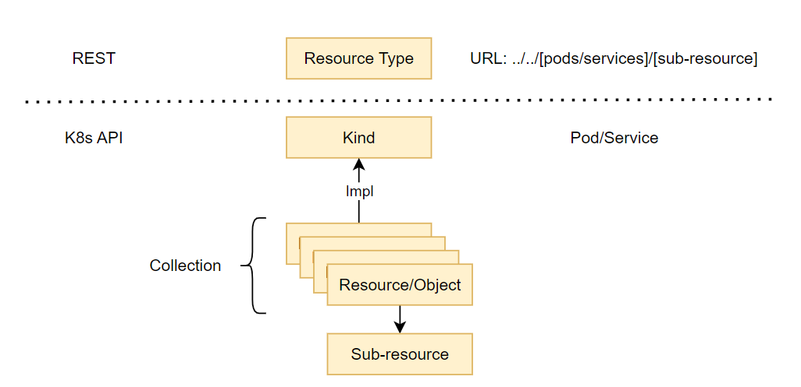

Kubernetes [API](https://kubernetes.io/zh-cn/docs/reference/using-api/api-concepts/) is resource-based **RESTful** programmatic **interface** provided by HTTP.

## Term

**Resource Type 资源类型**：URL 中使用的名称 pods/services/namespaces...

**Kind 类别**：资源类型的具体表示

**Resource 资源**：资源类型的具体实例，也表示一个 **Object 对象**

**Collection 集合**：资源类型的实例集合

**Sub-resource 子资源**：资源下的 URI 路径



## URI

Either namespaced or non-namesapced. **Note: core use `/api` not `/apis`.**

- `VERB /apis/GROUP/VERSION/RESOURCETYPE`
- `VERB /apis/GROUP/VERSION/RESOURCETYPE/NAME`
- `VERB /apis/GROUP/VERSION/namespaces/NAMESPACE/RESOURCETYPE`
- `VERB /apis/GROUP/VERSION/namespaces/NAMESPACE/RESOURCETYPE/NAME`


## Watch

list/get then watch 类订阅：跟踪自该初始请求以来的更改。基于 resourceVersion 乐观锁。

watch 时 API Server 会响应一个更改流，记录自 resourceVersion 后发生的所有操作。

etcd3 集群默认保存过去 5 分钟内发生的变更。

若 watch 因 resourceVersion 不存在失败，客户端必须能够处理 410 Gone，重新 get/list + watch。

```bash
GET /api/v1/namespaces/test/pods

# server returns
"metadata": {"resourceVersion":"10245"}

GET /api/v1/namespaces/test/pods?watch=1&resourceVersion=10245
```

**++ Bookmark 标记客户端请求的给定 resourceVersion 的所有更改都已发送。**

:smile: 提高性能，减少不必要的数据传输。++ Bookmark 后客户端从 bookmark 所在的 resourceVersion 重新开始即可。

:cry: 如果不带 Bookmark，那么客户端重新开始 watch，会再次获取中间大量事件，加压 API Server。

```bash
GET /api/v1/namespaces/test/pods?watch=1&resourceVersion=10245&allowWatchBookmarks=true
```

**++ sendInitialEvents 启动 watch 时受限发送一组初始事件表示当前资源的所有状态，再发送变化。**

:smile: 控制器在开始监听变化之前，首先了解资源的当前状态，避免状态不一致，以便做出进一步的决策，简化额外步骤获取。

```bash
GET /api/v1/namespaces/test/pods?watch=1&sendInitialEvents=true&allowWatchBookmarks=true&resourceVersion=&resourceVersionMatch=NotOlderThan

```

**++ APIResponseCompression 减少网络带宽**

:smile: content-encoding header

**++ Paginating 分页**

:smile: limit + continue (token with expiry) + remainingItemCount

```go
GET /api/v1/pods?limit=500
GET /api/v1/pods?limit=500&continue=ENCODED_CONTINUE_TOKEN_1
GET /api/v1/pods?limit=500&continue=ENCODED_CONTINUE_TOKEN_2
```

## List

Kind 置为 [Kind]List。

```go
GET /api/v1/services
{
    "kind": "ServiceList",
    ...
}
```

对于 kubectl，Kind 置为 List

```bash
$ kubectl get services -A -o yaml
```

```yaml
apiVersion: v1
kind: List
# ...
```

## Repr

Headers

- `Accept: application/json;as=Table;g=meta.k8s.io;v=v1`
- `Accpet: application/json`
- `Accept: application/vnd.kubernetes.protobuf` 性能 ↑ 但并非所有资源都支持比如 CRD。

## Deletion

1. Finalization
2. Removal

当客户端第一次发送 **delete** 请求删除资源时，`.metadata.deletionTimestamp` 设置为当前时间。Finalizer Controller 会执行对应的清理操作，任意时刻任意顺序。所有 Finalizer 执行完毕后，资源才会从 etcd 中移除。

## Validation

校验失败 API Server 会丢弃请求中的字段：OpenAPI 中未定义 & 字段重复出现

`kubectl --validate` 级别：

- `Ignore` 丢弃，不发送通知
- `Warn` (默认) 处理请求，发出告警
- `Strict` 拒绝 400 Bad request

## Dry-run

"干跑" 助于通过典型的请求阶段（准入链、验证、合并冲突）评估请求，直到将对象持久化到存储中。

`?dryRun[&pretty=true]` 允许副作用，最终会持久

`?dryRun=All` 不允许副作用，运行所有的 Admission plugins

```bash
POST /api/v1/namespaces/test/pods?dryRun
POST /api/v1/namespaces/test/pods?dryRun&pretry=true
POST /api/v1/namespaces/test/pods?dryRun=All
```

## Updates to existing

对于 PUT 请求，需要指定 `resourceVersion`，冲突返回 409 Conflict。

**patch** 通常适用于客户端希望进行的更改并不依赖于现有数据的场景。

Headers

- `Content-Type: application/apply-patch+yaml`
- `Content-Type: application/json-patch+json`
- `Content-Type: application/merge-patch+json`
- `Content-Type: application/strategic-merge-patch+json`

**Note: Server Side Apply 已取代 Strategic Merge Patch。**

## Server Side Apply 

更好的并发控制和冲突检测能力。它允许多个控制器或用户同时对同一资源进行更改，避免冲突。

API Server 跟踪所有新建对象的**受控字段（Managed Fields）**，并且在多个声明者（如不同的控制器）同时修改同一资源时，能够根据字段的所有权来自动解决冲突。客户端可手动解决冲突或通过 force 强制更改。

```bash
$ kubectl apply -f resource.yaml --server-side
$ kubectl apply -f resource.yaml --server-side --force-conflicts
```

通过 [`fieldManager`](https://kubernetes.io/zh-cn/docs/reference/kubernetes-api/common-parameters/common-parameters/#fieldManager) 用来跟踪和管理每个字段（field）是谁（哪个控制器或用户）设置或修改的。

使用 SAA 后，API Server 可以自动分配；也可以手动指定。

```bash
$ kubectl apply --server-side --field-manager=my-custom-manager -f my-resource.yaml
```

## ResourceVersion

乐观锁，确保资源对象的一致性；[v1.meta/ObjectMeta](https://kubernetes.io/docs/reference/generated/kubernetes-api/v1.30/#objectmeta-v1-meta) & [v1.meta/ListMeta](https://kubernetes.io/docs/reference/generated/kubernetes-api/v1.30/#listmeta-v1-meta)